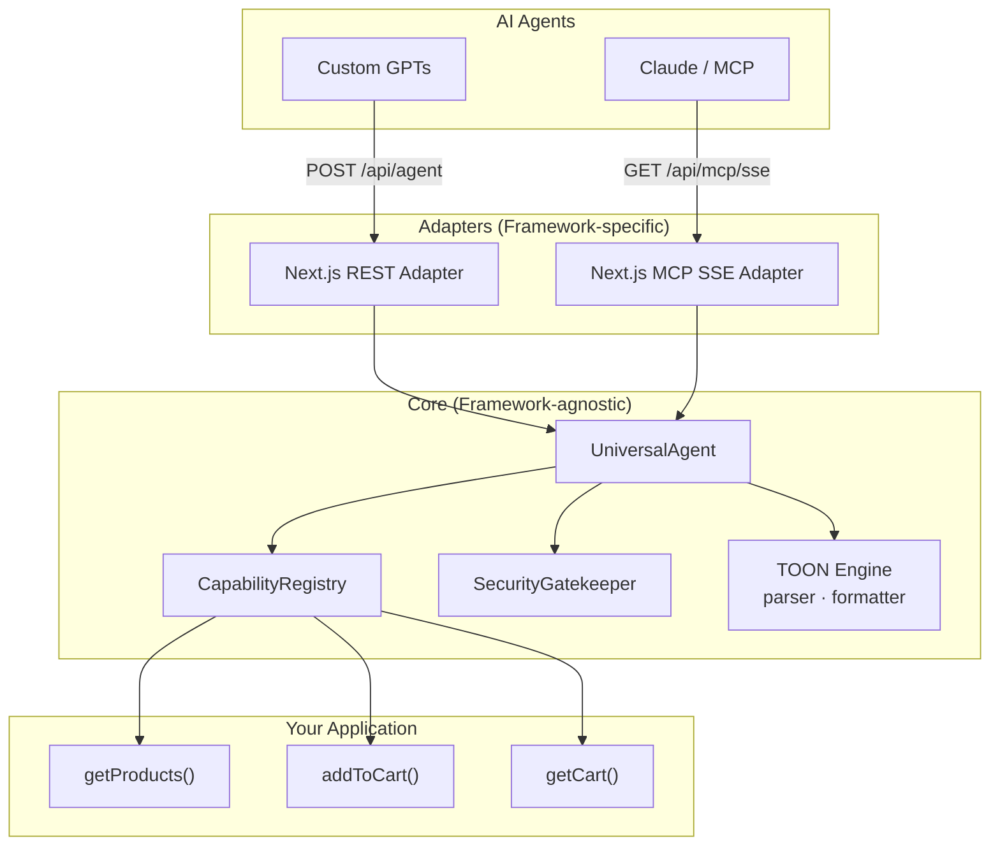
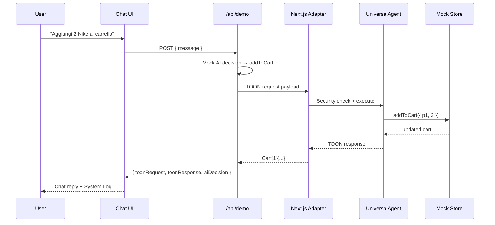

<div align="center">

# Lite-Toon

**Connect AI agents to your web app — with dramatically smaller payloads.**

A framework-agnostic TypeScript SDK that lets ChatGPT, Claude, and other AI agents securely call your business logic through a highly compressed data format called **TOON** (Token-Oriented Object Notation).

<br/>

[](https://www.typescriptlang.org/)
[](https://nextjs.org/)
[](https://modelcontextprotocol.io/)

<br/>

[Quick Start](#-quick-start) · [TOON Format](#-what-is-toon) · [Architecture](#-architecture) · [Examples](#-examples) · [API Reference](#-api-reference)

</div>

---

## ✦ What is Lite-Toon?

Lite-Toon is an open-source **Universal Agent API** layer. It sits between your web application and AI agents, translating natural-language intent into structured actions — and returning results in a format optimized for token efficiency.

Instead of shuttling verbose JSON back and forth, Lite-Toon uses **TOON**, a tabular notation that can reduce payload size by **40–70%** compared to equivalent JSON — saving tokens, latency, and cost on every agent interaction.

```
User says:  "Add 2 Nike shoes to my cart"
     ↓
AI decides:  addToCart({ productId: "p1", quantity: 2 })
     ↓
Lite-Toon:   validates → executes capability → returns TOON response
     ↓
AI reads:    Cart[1]{productId, quantity}:
               p1, 2
```

### Why it matters

| Problem | Lite-Toon solution |
|---|---|
| AI agents need structured access to your app | Register **capabilities** — typed functions the agent can call |
| JSON payloads waste tokens on every round-trip | **TOON** compresses tabular data into a minimal text format |
| Security is hard to get right | Built-in **SecurityGatekeeper** with API key validation and rate limiting |
| Every framework is different | **Framework-agnostic core** with pluggable adapters (Next.js included) |
| Claude and MCP need tool schemas | **Auto-generated MCP tool definitions** from your capability registry |

---

## ✦ What is TOON?

**TOON** (Token-Oriented Object Notation) is a compact, human-readable format designed for AI agent communication. It represents arrays of objects as a typed header followed by comma-separated rows — similar to CSV with a schema declaration.

### JSON vs TOON

**JSON** — 142 characters:

```json
[
  { "id": "u1", "name": "Alice", "role": "admin" },
  { "id": "u2", "name": "Bob", "role": "user" },
  { "id": "u3", "name": "Charlie", "role": "editor" }
]
```

**TOON** — 98 characters (~31% smaller):

```
Users[3]{id, name, role}:
  u1, "Alice", admin
  u2, "Bob", user
  u3, "Charlie", editor
```

### Format specification

```
EntityName[count]{field1, field2, field3}:
  value1, value2, value3
  value1, value2, value3
```

| Element | Description |
|---|---|
| `EntityName` | The entity type (e.g. `Users`, `Cart`, `Action`) |
| `[count]` | Number of records in the payload |
| `{fields}` | Comma-separated field names declared once in the header |
| Rows | Indented values, one record per line |
| Strings | Wrapped in double quotes, with `\"` escaping |
| Primitives | `null`, `true`, `false`, and numbers are written literally |

---

## ✦ Architecture

Lite-Toon follows a strict **inward dependency** model: adapters depend on the core, never the reverse.



### Project structure

```
lite-toon/                   # npm workspaces monorepo
├── packages/
│   ├── toon/                # @lite-toon/toon — TOON parser & formatter
│   ├── core/                # @lite-toon/core — UniversalAgent, registry, security
│   ├── adapter-next/        # @lite-toon/adapter-next — Next.js handlers
│   └── bridge/              # @lite-toon/bridge — public SDK entry point
│
└── apps/
    └── demo/                # Next.js e-commerce PoC (consumes @lite-toon/bridge)
        └── src/
            ├── app/         # API routes & chat UI
            ├── demo/        # Mock e-commerce capabilities
            └── agent.ts     # Agent singleton for /api/agent
```

---

## ✦ Quick Start

### Prerequisites

- **Node.js** 18+
- **npm**, yarn, pnpm, or bun

### Installation

**For your own app (when published to npm):**

```bash
npm install @lite-toon/bridge
```

**To run the demo from source:**

```bash
git clone https://github.com/Luke-official/lite-toon.git
cd lite-toon
npm install
npm run build
```

### Run the demo

```bash
npm run dev
```

Open [http://localhost:3000](http://localhost:3000) to see the interactive e-commerce chatbot. Type a message like:

> *Aggiungi 2 paia di scarpe Nike al carrello*

The right panel shows the raw **TOON request and response** payloads in real time, so you can see exactly how much data travels between the AI and your app.

### Test the agent API

With the dev server running:

```bash
npm run test:api
```

---

## ✦ Examples

### 1. Register a capability

Capabilities are the building blocks of your agent API. Each one is a named function with an optional JSON Schema for MCP compatibility.

```typescript
import { UniversalAgent, Capability } from '@lite-toon/bridge';

const getProducts: Capability = {
  name: 'getProducts',
  description: 'Returns the list of available products.',
  execute: async () => ({
    success: true,
    data: [
      { id: 'p1', name: 'Nike Shoes', price: 120 },
      { id: 'p2', name: 'Adidas T-Shirt', price: 35 },
    ],
  }),
};

const addToCart: Capability = {
  name: 'addToCart',
  description: 'Adds a product to the user cart.',
  schema: {
    type: 'object',
    properties: {
      productId: { type: 'string' },
      quantity:  { type: 'number' },
    },
    required: ['productId', 'quantity'],
  },
  execute: async ({ productId, quantity }) => {
    // your business logic here
    return { success: true, data: [{ productId, quantity }] };
  },
};

const agent = new UniversalAgent({
  capabilities: [getProducts, addToCart],
});
```

### 2. Wire up a Next.js API route

Route files stay thin — all logic lives in the adapter and core.

```typescript
// app/api/agent/route.ts
import { createNextAgentHandler } from '@lite-toon/bridge/next';
import { agent } from '@/agent';

export const POST = createNextAgentHandler(agent);
```

### 3. Send a TOON request

```bash
curl -X POST http://localhost:3000/api/agent \
  -H "Content-Type: text/plain" \
  -H "x-agent-id: my-gpt" \
  -d 'request[1]{action, params}:
  "getUsers", "{}"'
```

**Response:**

```
GetUsersResult[3]{id, name, role}:
  u1, "Alice", admin
  u2, "Bob", user
  u3, "Charlie", editor
```

### 4. Send a JSON request (also supported)

The REST adapter accepts both TOON and JSON payloads:

```bash
curl -X POST http://localhost:3000/api/agent \
  -H "Content-Type: application/json" \
  -d '{"action": "addToCart", "params": {"productId": "p1", "quantity": 2}}'
```

**Response (TOON):**

```
AddToCartResult[1]{productId, quantity}:
  p1, 2
```

### 5. Export MCP tool schemas

Registered capabilities are automatically translated into MCP-compatible tool definitions:

```typescript
const tools = agent.registry.exportMcpTools();
// → [{ name: "addToCart", description: "...", inputSchema: { ... } }, ...]
```

### 6. Use the TOON engine directly

The parser and formatter are pure TypeScript — no framework required.

```typescript
import { formatToon, parseToon } from '@lite-toon/bridge';
// or: import { formatToon, parseToon } from '@lite-toon/bridge/toon';

const toon = formatToon('Products', [
  { id: 'p1', name: 'Nike Shoes', price: 120 },
]);

console.log(toon);
// Products[1]{id, name, price}:
//   p1, "Nike Shoes", 120

const result = parseToon(toon);
// { success: true, data: { entity: 'Products', records: [...] } }
```

---

## ✦ API Reference

### Endpoints

| Method | Path | Description |
|---|---|---|
| `POST` | `/api/agent` | REST/Webhook endpoint for Custom GPTs and direct TOON/JSON calls |
| `POST` | `/api/demo` | Interactive demo — accepts natural language, returns TOON payloads |
| `GET` | `/api/mcp/sse` | MCP Server-Sent Events stream (Claude integration) |
| `POST` | `/api/mcp/message` | MCP JSON-RPC message handler |

### Request headers

| Header | Required | Description |
|---|---|---|
| `Content-Type` | Yes | `text/plain` for TOON, `application/json` for JSON |
| `x-agent-id` | Recommended | Identifier for rate limiting and auditing |
| `Authorization` | Optional | `Bearer <api-key>` for authenticated access |

### Security

The `SecurityGatekeeper` validates every request before execution:

- **API key validation** — rejects requests with invalid tokens
- **Rate limiting** — configurable per-agent request limits (default: 100 req/min)
- **Pluggable store** — swap the in-memory limiter for Redis or any custom backend

```typescript
import { SecurityGatekeeper, InMemoryRateLimiterStore } from '@lite-toon/bridge';

const gatekeeper = new SecurityGatekeeper(
  new InMemoryRateLimiterStore(60_000), // 1-minute window
  50 // max 50 requests per window
);

await gatekeeper.checkAccess({
  agentId: 'my-agent',
  apiKey: 'secret-dummy-token',
  ip: '192.168.1.1',
});
```

### Error responses

Errors are returned in TOON format so the calling agent can parse and self-correct:

```
error[1]{message}:
  "Capability 'unknownAction' not found or not implemented yet."
```

---

## ✦ How the demo works

The included e-commerce PoC demonstrates the full end-to-end flow:



---

## ✦ Roadmap

- [x] Framework-agnostic core (TOON engine, registry, security)
- [x] Next.js REST adapter
- [x] Next.js MCP SSE adapter
- [x] MCP tool schema auto-generation
- [x] Interactive e-commerce demo with TOON log panel
- [ ] MCP message handler (`/api/mcp/message`)
- [ ] Express / Hono / Edge adapters
- [x] Monorepo with publishable `@lite-toon/*` packages
- [ ] npm registry publish (`@lite-toon/bridge`)
- [ ] Redis-backed rate limiter example

---

## ✦ Contributing

Contributions are welcome. Whether it's a bug fix, a new adapter, or improved documentation — PRs are appreciated.

1. Fork the repository
2. Create a feature branch (`git checkout -b feat/my-feature`)
3. Commit your changes
4. Push and open a Pull Request

Please keep the architectural boundary intact: **`packages/core` and `packages/toon` must never import from adapters or frameworks.** Demo app code lives in `apps/demo/`.

---

<div align="center">

Built with precision for the age of AI agents.

**Lite-Toon** — less tokens, more action.

</div>
