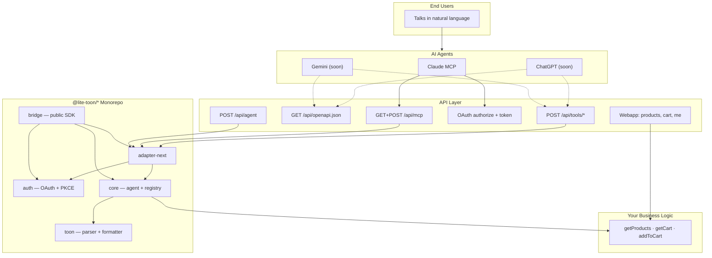
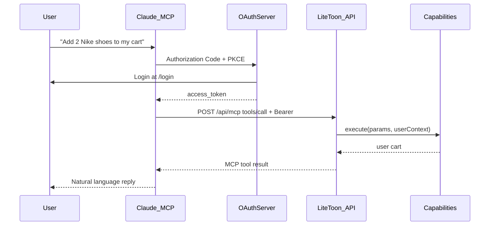

<div align="center">

# Lite-Toon

**Your web app, in every AI chat — starting with Claude.**

Turn any web application into something your users can drive with natural language. No API keys for them. No JSON for them. They just talk to the AI they already use every day.

Under the hood, Lite-Toon is a **framework-agnostic TypeScript SDK** that connects AI agents to your business logic — with **OAuth per-user auth**, **auto-generated schemas**, and **TOON**, a wire format that shrinks payloads by up to **70%**.

> **⚠️ Early development** — Lite-Toon is under active development. **Supported today:** **Next.js App Router** and **Claude** (MCP over Streamable HTTP). **Not supported yet** (coming soon): ChatGPT, Gemini, and additional frameworks (Express, Hono, Edge).

<br/>

[](https://github.com/Luke-official/lite-toon/actions/workflows/ci.yml)
[](LICENSE)
[](https://www.typescriptlang.org/)
[](https://nextjs.org/)
[](https://modelcontextprotocol.io/)
[](https://oauth.net/2/)

<br/>

[Quick Start](#-quick-start) · [Documentation](docs/README.md) · [Connect Claude](#-connect-claude) · [TOON](#-what-is-toon) · [Architecture](#-architecture) · [API](#-api-reference) · [Security](#-security--demo-limitations) · [Contributing](CONTRIBUTING.md) · [Changelog](CHANGELOG.md)

</div>

---

## ✦ The pitch

> *"Add 2 pairs of Nike shoes to my cart."*

That's it. That's what your customer types in Claude. Lite-Toon handles the rest: OAuth login, scoped permissions, capability routing, per-user cart — and a response so compact your token bill notices.

```
Customer → Claude (MCP connector)
              ↓  OAuth (once)
              ↓  tools/call addToCart
Lite-Toon   → validate user → execute capability → JSON or TOON
              ↓
Customer ← "Done! I added 2x Nike Shoes to your cart."
```

**One registry. One supported agent today. More platforms soon.**

| Status | Platform | How it connects | What Lite-Toon generates |
|---|---|---|---|
| ✅ **Supported** | **Claude** | MCP Streamable HTTP at `/api/mcp` + OAuth | MCP tool schemas + OAuth discovery |
| ✅ **Supported** | **Next.js App Router** | Route factories in `@lite-toon/adapter-next` | Thin API route handlers |
| 🔜 Not supported yet | **ChatGPT** | Custom GPT Actions + OAuth | OpenAPI 3.1 from your capabilities |
| 🔜 Not supported yet | **Gemini** | Extensions / Gems + OpenAPI | Gemini function declarations |
| 🔜 Coming soon | **Express / Hono / Edge** | Framework adapters | Same core, different transport |

---

## ✦ Why Lite-Toon?

| Pain | Fix |
|---|---|
| "We need an AI chatbot" | Your users already have one — plug into **theirs** |
| JSON eats tokens on every call | **TOON** compresses tabular data 40–70% |
| Who is this user? Whose cart? | **OAuth 2.0 + PKCE** with per-user `ExecutionContext` |
| Multiple AI platforms = duplicate work | **One `CapabilityRegistry`**, many auto-exports (more agents coming) |
| Security nightmares | `SecurityGatekeeper` — rate limits, scopes, token resolution |
| Framework lock-in | Pure TS core; **Next.js App Router** adapter ships today |

---

## ✦ What is TOON?

**TOON** (Token-Oriented Object Notation) is a compact, human-readable format built for agent round-trips. Arrays of objects become a typed header + rows — like CSV with a schema, designed for LLM consumption.

**JSON** — 142 chars:

```json
[
  { "id": "u1", "name": "Alice", "role": "admin" },
  { "id": "u2", "name": "Bob", "role": "user" },
  { "id": "u3", "name": "Charlie", "role": "editor" }
]
```

**TOON** — 98 chars (~31% smaller):

```
Users[3]{id, name, role}:
  u1, "Alice", admin
  u2, "Bob", user
  u3, "Charlie", editor
```

Use **TOON** on `/api/agent` for token-optimized direct integrations. Use **JSON** on MCP and (when available) `/api/tools/*` — because consumer AI platforms expect JSON.

---

## ✦ Architecture

Strict inward dependencies: adapters → core. Core imports nothing from frameworks.



### Monorepo layout

```
lite-toon/
├── packages/
│   ├── toon/           @lite-toon/toon       — TOON parser & formatter
│   ├── core/           @lite-toon/core       — UniversalAgent, registry, security
│   ├── auth/           @lite-toon/auth       — OAuth 2.0 server + in-memory store
│   ├── adapter-next/   @lite-toon/adapter-next — Next.js route factories
│   └── bridge/         @lite-toon/bridge     — single import for app developers
│
└── apps/
    └── demo/           Next.js e-commerce PoC + /connect setup page
```

---

## ✦ Quick Start

### Prerequisites

- **Node.js** 18+
- **npm** 10+ (workspaces)

### Clone & run

```bash
git clone https://github.com/Luke-official/lite-toon.git
cd lite-toon
npm install
cp .env.example apps/demo/.env.local   # optional — see Environment variables below
npm run build
npm run dev:clean    # kills stale ports 3000–3002, then starts turbo dev
```

### Environment variables

Copy [`.env.example`](.env.example) to `apps/demo/.env.local` if you need overrides. All variables are optional for local development.

| Variable | Default | Used by |
|---|---|---|
| `OAUTH_CLIENT_ID` | `lite-toon-demo` | Demo OAuth server (`apps/demo/src/lib/auth.ts`) |
| `BASE_URL` | `http://localhost:3000` | `apps/demo/scripts/test-*.js` |

Never commit `.env` or `.env.local` — they are listed in `.gitignore`.

Open the demo:

| URL | What |
|---|---|
| [localhost:3000](http://localhost:3000) | LiteShop — browse catalog, sign in, add to cart |
| [localhost:3000/connect](http://localhost:3000/connect) | Developer guide — **Claude** connector setup |
| [localhost:3000/login](http://localhost:3000/login) | Session login (same username as Claude OAuth) |

> Port already in use? `npm run kill-ports` frees 3000, 3001, and 3002.

Sign in, click **Add to cart** on a product, or connect Claude via `/connect` and ask it to add items — both update the same cart.

### Run tests

With the dev server running:

```bash
npm run test:api    -w @lite-toon/demo   # TOON via /api/agent
npm run test:oauth  -w @lite-toon/demo   # full OAuth + tools flow
npm run test:mcp    -w @lite-toon/demo   # MCP initialize + tools/call
```

---

## ✦ Documentation

Full documentation lives in [`docs/`](docs/README.md):

| Guide | Description |
|---|---|
| [Getting Started](docs/getting-started.md) | Install, run, test, first curl |
| [Study Guide](docs/guide/study-guide.md) | 8-day learning path for the entire codebase |
| [Architecture](docs/architecture/overview.md) | Monorepo layers, dependency rules, data flows |
| [Capabilities](docs/concepts/capabilities.md) | Define and register agent tools |
| [Next.js Integration](docs/integration/nextjs.md) | Wire Lite-Toon into your app |
| [API Reference](docs/reference/api.md) | Every endpoint, header, and example |
| [TOON Format](docs/concepts/toon.md) | Wire format specification |
| [OAuth](docs/concepts/oauth.md) | PKCE flow, tokens, scopes |
| [MCP](docs/concepts/mcp.md) | Claude integration protocol |
| [Security](docs/security/overview.md) | Production hardening checklist |
| [Packages](docs/reference/packages.md) | `@lite-toon/*` API surface |
| [Demo App](docs/guide/demo-app.md) | Reference app walkthrough |
| [Connect Agents](docs/integration/connect-agents.md) | Claude setup only |
| [Capability Flows](docs/concepts/capability-flows.md) | Per-capability sequence diagrams |

---

## ✦ Connect Claude

Full walkthrough: [`docs/integration/connect-agents.md`](docs/integration/connect-agents.md)

**Claude Chat (browser) — 5-minute setup:**

1. Run the demo: `npm run dev:clean`
2. Expose HTTPS: `ngrok http 3000`
3. In Claude → **Settings → Connectors → Add custom connector**
4. MCP server URL: `https://<your-ngrok-host>/api/mcp`
5. Click **Connect** — Claude discovers OAuth via `/.well-known/oauth-protected-resource`
6. Sign in at `/login` when redirected
7. Ask: *"What products do you have?"* then *"Add 2 Nike shoes to my cart"*

Demo OAuth client ID: `lite-toon-demo` · Scopes: `cart:read cart:write`

> **ChatGPT and Gemini are not supported yet.** They will be added in a future release.

---

## ✦ Examples

### 1. Register capabilities (with user context + scopes)

```typescript
import { UniversalAgent, Capability, ExecutionContext } from '@lite-toon/bridge';
import { OAuthServer, InMemoryAuthStore } from '@lite-toon/bridge';

const oauth = new OAuthServer({
  store: new InMemoryAuthStore(),
  clientId: 'my-app',
  allowedRedirectUris: ['https://chat.openai.com/aip/oauth/callback'],
});

const addToCart: Capability = {
  name: 'addToCart',
  description: 'Adds a product to the user cart.',
  scopes: ['cart:write'],
  schema: {
    type: 'object',
    properties: {
      productId: { type: 'string' },
      quantity: { type: 'number' },
    },
    required: ['productId', 'quantity'],
  },
  execute: async (params, context?: ExecutionContext) => {
    const userId = context!.userId;
    // your per-user business logic here
    return { success: true, data: { userId, ...params } };
  },
};

const agent = new UniversalAgent({
  tokenResolver: oauth,
  capabilities: [addToCart],
});
```

### 2. Wire Next.js routes (thin intercoms)

```typescript
// app/api/agent/route.ts       — TOON/JSON direct access
import { createNextAgentHandler } from '@lite-toon/bridge/next';
export const POST = createNextAgentHandler(agent);

// app/api/tools/[name]/route.ts — ChatGPT & Gemini (not supported yet)
import { createNextToolsHandler } from '@lite-toon/bridge/next';
const handler = createNextToolsHandler(agent);
export const POST = (req, ctx) => handler(req, ctx);

// app/api/mcp/route.ts          — Claude MCP (Streamable HTTP, recommended)
import { createMCPStreamableHttpHandler } from '@lite-toon/bridge/next';
const handler = createMCPStreamableHttpHandler(agent);
export const GET = handler;
export const POST = handler;
```

### 3. Auto-export schemas (one registry, multiple formats)

```typescript
agent.registry.exportMcpTools();                  // → Claude MCP (supported)
agent.registry.exportOpenApiDocument({ ... });    // → ChatGPT (not supported yet)
agent.registry.exportGeminiFunctionDeclarations(); // → Gemini (not supported yet)
```

### 4. TOON in action

```bash
curl -X POST http://localhost:3000/api/agent \
  -H "Content-Type: text/plain" \
  -H "x-agent-id: my-agent" \
  -d 'request[1]{action, params}:
  "getProducts", "{}"'
```

```
GetProductsResult[3]{id, name, price}:
  "p1", "Nike Shoes", 120
  "p2", "Adidas T-Shirt", 35
  "p3", "Puma Socks", 15
```

---

## ✦ API Reference

### Endpoints (demo app)

**Webapp** (session cookie) — humans in the browser:

| Method | Path | Auth | Description |
|---|---|---|---|
| `GET` | `/api/products` | — | Product catalog |
| `GET` | `/api/cart` | Session | Cart state |
| `POST` | `/api/cart` | Session | Add to cart |
| `DELETE` | `/api/cart` | Session | Remove line or clear cart |
| `GET` | `/api/me` | Session | Current user |

**Lite-Toon bridge** (OAuth Bearer) — external AI assistants:

| Method | Path | Auth | Format | Consumer |
|---|---|---|---|---|
| `GET`+`POST` | `/api/mcp` | OAuth Bearer | JSON-RPC (Streamable HTTP) | **Claude** |
| `POST` | `/api/tools/{name}` | OAuth Bearer | JSON | ❌ Not supported (ChatGPT/Gemini — coming soon) |
| `GET` | `/api/openapi.json` | — | OpenAPI 3.1 | ❌ Not supported (ChatGPT/Gemini — coming soon) |
| `GET` | `/api/oauth/authorize` | Session | redirect | OAuth flow |
| `POST` | `/api/oauth/token` | — | JSON | OAuth PKCE exchange |
| `POST` | `/api/oauth/register` | — | JSON | Dynamic client registration (MCP) |
| `GET` | `/.well-known/oauth-protected-resource` | — | JSON | MCP OAuth discovery |
| `GET` | `/.well-known/oauth-authorization-server` | — | JSON | OAuth server metadata |
| `POST` | `/api/agent` | Optional | TOON / JSON | Direct integrations |

### Headers

| Header | When | Description |
|---|---|---|
| `Authorization: Bearer <token>` | Tools, MCP | OAuth access token (user-scoped) |
| `x-agent-id` | Always recommended | Rate-limit key + audit trail |
| `Content-Type: text/plain` | `/api/agent` | TOON request body |
| `Accept: application/json` | `/api/agent` | JSON response instead of TOON |

### Security stack

- **OAuth 2.0 + PKCE** — users authenticate once; agents get scoped tokens
- **Per-user `ExecutionContext`** — `userId` + `scopes` on every capability call
- **Rate limiting** — configurable per `agentId` (default 100 req/min)
- **Scope enforcement** — capabilities declare required scopes (`cart:read`, `cart:write`)

---

## ✦ Security & demo limitations

> **The demo app is a reference implementation, not a production auth system.** The SDK packages (`@lite-toon/core`, `@lite-toon/auth`, …) provide building blocks; you are responsible for hardening them before exposing real user data.

### What is safe to publish

| Item | Notes |
|---|---|
| Source code in this repo | No API keys, `.env` files, or private keys are committed |
| Demo OAuth client ID `lite-toon-demo` | Public identifier for Custom GPT / MCP setup — not a secret |
| `secret-dummy-token` in `SecurityGatekeeper` | Placeholder for legacy API-key checks in samples — not a real credential |

### Demo-only behaviors (do not deploy as-is)

| Area | Demo behavior | Production expectation |
|---|---|---|
| **Login** | Username only — no password | Real identity provider or credential verification |
| **OAuth tokens** | Generated with `Math.random()` | `crypto.randomBytes()` or a signed JWT strategy |
| **Auth store** | In-memory (`InMemoryAuthStore`) | Redis, database, or managed IdP session store |
| **Session cookie** | `httpOnly` + `sameSite: lax`, no `secure` flag | Set `secure: true` behind HTTPS |
| **`POST /api/agent`** | Anonymous access allowed; only `getProducts` works without a user | Require Bearer tokens or API keys for all sensitive capabilities |
| **Rate limiting** | In-memory, per process | Shared store (e.g. Redis) across instances |

### Endpoint auth summary

| Path | Production guidance |
|---|---|
| `/api/mcp`, `/api/tools/*` | Always require OAuth Bearer + scopes for protected capabilities |
| `/api/oauth/*` | Replace in-memory store; validate redirect URIs for your domain |
| `/api/agent` | Treat as internal unless you add `requireAuth` at the gatekeeper |
| `/api/cart`, `/api/me` | Protect with real session auth in production |

### Before you fork or deploy

1. Copy [`.env.example`](.env.example) — never commit real secrets.
2. Rotate any tokens if they were ever pasted into logs or chat tools.
3. Review [`CONTRIBUTING.md`](CONTRIBUTING.md) for architecture rules and security expectations.

---

## ✦ How the demo works



The demo shop UI uses normal REST (`/api/cart`) for humans. Claude uses the Lite-Toon bridge (`/api/mcp`). Both call the same capabilities — sign in with the same username to share a cart.

---

## ✦ Roadmap

- [x] Framework-agnostic core (`@lite-toon/core`, `@lite-toon/toon`)
- [x] Monorepo with `@lite-toon/*` workspaces + Turbo
- [x] Next.js App Router adapters (agent, MCP Streamable HTTP, OAuth)
- [x] OAuth 2.0 user auth with per-user carts + MCP OAuth discovery
- [x] Claude via MCP Streamable HTTP (`/api/mcp`)
- [x] Demo shop UI + `/connect` developer guide
- [ ] ChatGPT Custom GPT / Actions (OpenAPI + `/api/tools/*`)
- [ ] Gemini Extensions / OpenAPI integration
- [ ] Publish `@lite-toon/bridge` to npm
- [ ] Express / Hono / Edge adapters
- [ ] Redis-backed auth store + rate limiter

---

## ✦ Contributing

PRs welcome — bug fixes, adapters, docs, and tests.

See **[CONTRIBUTING.md](CONTRIBUTING.md)** for setup, dependency rules, code style, and the pull request workflow.

Please read our **[Code of Conduct](CODE_OF_CONDUCT.md)**. To report security issues privately, see **[SECURITY.md](SECURITY.md)**.

**Golden rule:** `packages/core` and `packages/toon` never import from adapters or frameworks. Demo code lives in `apps/demo/`.

Licensed under [MIT](LICENSE). See [CHANGELOG.md](CHANGELOG.md) for release history.

---

<div align="center">

**The age of AI agents is here. Your app should be in the conversation.**

Lite-Toon — *less tokens, more action — Claude first, more agents soon.*

<br/>

[⭐ Star us on GitHub](https://github.com/Luke-official/lite-toon) · [Read the connect guide](docs/integration/connect-agents.md)

</div>
