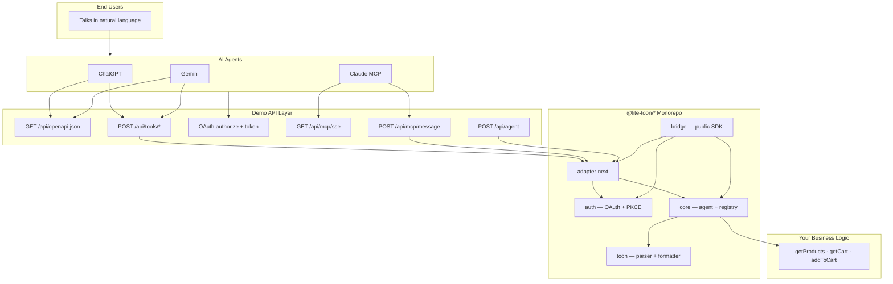
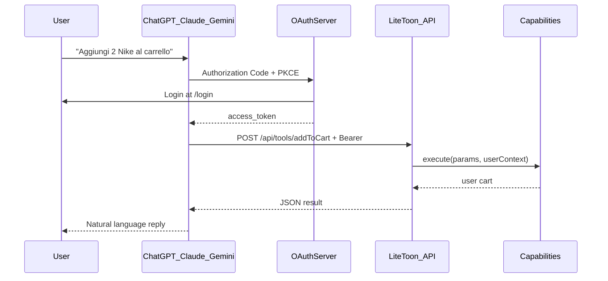

<div align="center">

# Lite-Toon

**Your web app, in every AI chat — ChatGPT, Claude, Gemini.**

Turn any web application into something your users can drive with natural language. No API keys for them. No JSON for them. They just talk to the AI they already use every day.

Under the hood, Lite-Toon is a **framework-agnostic TypeScript SDK** that connects AI agents to your business logic — with **OAuth per-user auth**, **auto-generated OpenAPI & MCP schemas**, and **TOON**, a wire format that shrinks payloads by up to **70%**.

<br/>

[](https://www.typescriptlang.org/)
[](https://nextjs.org/)
[](https://modelcontextprotocol.io/)
[](https://oauth.net/2/)

<br/>

[Quick Start](#-quick-start) · [Connect Agents](#-connect-chatgpt-claude--gemini) · [TOON](#-what-is-toon) · [Architecture](#-architecture) · [API](#-api-reference) · [Security](#-security--demo-limitations)

</div>

---

## ✦ The pitch

> *"Aggiungi 2 paia di scarpe Nike al carrello."*

That's it. That's what your customer types in ChatGPT. Lite-Toon handles the rest: OAuth login, scoped permissions, capability routing, per-user cart — and a response so compact your token bill notices.

```
Customer → ChatGPT / Claude / Gemini
              ↓  OAuth (once)
              ↓  POST /api/tools/addToCart
Lite-Toon   → validate user → execute capability → JSON or TOON
              ↓
Customer ← "Perfetto! Ho aggiunto 2x Nike Shoes al carrello."
```

**One registry. Three agent platforms. Zero duplicate integration work.**

| Agent | How it connects | What Lite-Toon generates |
|---|---|---|
| **ChatGPT** | Custom GPT Actions + OAuth | OpenAPI 3.1 from your capabilities |
| **Claude** | MCP over SSE + JSON-RPC | MCP tool schemas |
| **Gemini** | Extensions / Gems + OpenAPI | Gemini function declarations |

---

## ✦ Why Lite-Toon?

| Pain | Fix |
|---|---|
| "We need an AI chatbot" | Your users already have one — plug into **theirs** |
| JSON eats tokens on every call | **TOON** compresses tabular data 40–70% |
| Who is this user? Whose cart? | **OAuth 2.0 + PKCE** with per-user `ExecutionContext` |
| ChatGPT, Claude, Gemini = 3 integrations | **One `CapabilityRegistry`**, three auto-exports |
| Security nightmares | `SecurityGatekeeper` — rate limits, scopes, token resolution |
| Framework lock-in | Pure TS core; Next.js adapter ships today |

---

## ✦ What is TOON?

**TOON** (Token-Oriented Object Notation) is a compact, human-readable format built for agent round-trips. Arrays of objects become a typed header + rows — like CSV with a schema, designed for LLM consumption.

**JSON** — 142 chars:

```json
[
  { "id": "u1", "name": "Alice", "role": "admin" },
  { "id": "u2", "name": "Bob", "role": "user" },
  { "id": "u3", "name": "Charlie", "role": "editor" }
]
```

**TOON** — 98 chars (~31% smaller):

```
Users[3]{id, name, role}:
  u1, "Alice", admin
  u2, "Bob", user
  u3, "Charlie", editor
```

Use **TOON** on `/api/agent` for token-optimized direct integrations. Use **JSON** on `/api/tools/*` and MCP — because ChatGPT doesn't speak TOON (yet).

---

## ✦ Architecture

Strict inward dependencies: adapters → core. Core imports nothing from frameworks.



### Monorepo layout

```
lite-toon/
├── packages/
│   ├── toon/           @lite-toon/toon       — TOON parser & formatter
│   ├── core/           @lite-toon/core       — UniversalAgent, registry, security
│   ├── auth/           @lite-toon/auth       — OAuth 2.0 server + in-memory store
│   ├── adapter-next/   @lite-toon/adapter-next — Next.js route factories
│   └── bridge/         @lite-toon/bridge     — single import for app developers
│
└── apps/
    └── demo/           Next.js e-commerce PoC + /connect setup page
```

---

## ✦ Quick Start

### Prerequisites

- **Node.js** 18+
- **npm** 10+ (workspaces)

### Clone & run

```bash
git clone https://github.com/Luke-official/lite-toon.git
cd lite-toon
npm install
cp .env.example apps/demo/.env.local   # optional — see Environment variables below
npm run build
npm run dev:clean    # kills stale ports 3000–3002, then starts turbo dev
```

### Environment variables

Copy [`.env.example`](.env.example) to `apps/demo/.env.local` if you need overrides. All variables are optional for local development.

| Variable | Default | Used by |
|---|---|---|
| `OAUTH_CLIENT_ID` | `lite-toon-demo` | Demo OAuth server (`apps/demo/src/lib/auth.ts`) |
| `BASE_URL` | `http://localhost:3000` | `apps/demo/scripts/test-*.js` |

Never commit `.env` or `.env.local` — they are listed in `.gitignore`.

Open the demo:

| URL | What |
|---|---|
| [localhost:3000](http://localhost:3000) | Interactive shop + TOON log panel |
| [localhost:3000/connect](http://localhost:3000/connect) | Merchant setup guide for ChatGPT / Claude / Gemini |
| [localhost:3000/login](http://localhost:3000/login) | OAuth login for agent users |

> Port already in use? `npm run kill-ports` frees 3000, 3001, and 3002.

Try in the chat UI:

> *Aggiungi 2 paia di scarpe Nike al carrello*

Watch the **System Log** panel light up with raw TOON payloads in real time.

### Run tests

With the dev server running:

```bash
npm run test:api    -w @lite-toon/demo   # TOON via /api/agent
npm run test:oauth  -w @lite-toon/demo   # full OAuth + tools flow
npm run test:mcp    -w @lite-toon/demo   # MCP initialize + tools/call
```

---

## ✦ Connect ChatGPT, Claude & Gemini

Full walkthrough: [`docs/connect-agents.md`](docs/connect-agents.md)

**For merchants (5-minute setup):**

1. Deploy the demo (or your app wired with Lite-Toon).
2. Open `/connect` — copy the OpenAPI URL and OAuth endpoints.
3. **ChatGPT:** Custom GPT → Import Actions from `/api/openapi.json` → OAuth with PKCE.
4. **Claude:** MCP client → SSE at `/api/mcp/sse` → Bearer token from OAuth.
5. **Gemini:** Import the same OpenAPI → same OAuth config.

**For end users:** share a link to your Custom GPT or Gem. They talk, they shop. Done.

Demo OAuth client ID: `lite-toon-demo` · Scopes: `cart:read cart:write`

---

## ✦ Examples

### 1. Register capabilities (with user context + scopes)

```typescript
import { UniversalAgent, Capability, ExecutionContext } from '@lite-toon/bridge';
import { OAuthServer, InMemoryAuthStore } from '@lite-toon/bridge';

const oauth = new OAuthServer({
  store: new InMemoryAuthStore(),
  clientId: 'my-app',
  allowedRedirectUris: ['https://chat.openai.com/aip/oauth/callback'],
});

const addToCart: Capability = {
  name: 'addToCart',
  description: 'Adds a product to the user cart.',
  scopes: ['cart:write'],
  schema: {
    type: 'object',
    properties: {
      productId: { type: 'string' },
      quantity: { type: 'number' },
    },
    required: ['productId', 'quantity'],
  },
  execute: async (params, context?: ExecutionContext) => {
    const userId = context!.userId;
    // your per-user business logic here
    return { success: true, data: { userId, ...params } };
  },
};

const agent = new UniversalAgent({
  tokenResolver: oauth,
  capabilities: [addToCart],
});
```

### 2. Wire Next.js routes (thin intercoms)

```typescript
// app/api/agent/route.ts       — TOON/JSON direct access
import { createNextAgentHandler } from '@lite-toon/bridge/next';
export const POST = createNextAgentHandler(agent);

// app/api/tools/[name]/route.ts — ChatGPT & Gemini Actions
import { createNextToolsHandler } from '@lite-toon/bridge/next';
const handler = createNextToolsHandler(agent);
export const POST = (req, ctx) => handler(req, ctx);

// app/api/mcp/message/route.ts  — Claude MCP
import { createMCPMessageHandler } from '@lite-toon/bridge/next';
export const POST = createMCPMessageHandler(agent);
```

### 3. Auto-export schemas (one registry, three formats)

```typescript
agent.registry.exportMcpTools();                  // → Claude MCP
agent.registry.exportOpenApiDocument({ ... });    // → ChatGPT & Gemini
agent.registry.exportGeminiFunctionDeclarations(); // → Gemini API
```

### 4. TOON in action

```bash
curl -X POST http://localhost:3000/api/agent \
  -H "Content-Type: text/plain" \
  -H "x-agent-id: my-agent" \
  -d 'request[1]{action, params}:
  "getProducts", "{}"'
```

```
GetProductsResult[3]{id, name, price}:
  "p1", "Nike Shoes", 120
  "p2", "Adidas T-Shirt", 35
  "p3", "Puma Socks", 15
```

---

## ✦ API Reference

### Endpoints (demo app)

| Method | Path | Auth | Format | Consumer |
|---|---|---|---|---|
| `POST` | `/api/tools/{name}` | OAuth Bearer | JSON | ChatGPT, Gemini |
| `GET` | `/api/openapi.json` | — | OpenAPI 3.1 | Action schema import |
| `GET` | `/api/oauth/authorize` | Session | redirect | OAuth flow |
| `POST` | `/api/oauth/token` | — | JSON | OAuth PKCE exchange |
| `POST` | `/api/mcp/message` | OAuth Bearer | JSON-RPC | Claude MCP |
| `GET` | `/api/mcp/sse` | — | SSE | Claude MCP stream |
| `POST` | `/api/agent` | Optional | TOON / JSON | Direct integrations |
| `POST` | `/api/demo` | Demo token | JSON + TOON log | Interactive UI |

### Headers

| Header | When | Description |
|---|---|---|
| `Authorization: Bearer <token>` | Tools, MCP | OAuth access token (user-scoped) |
| `x-agent-id` | Always recommended | Rate-limit key + audit trail |
| `Content-Type: text/plain` | `/api/agent` | TOON request body |
| `Accept: application/json` | `/api/agent` | JSON response instead of TOON |

### Security stack

- **OAuth 2.0 + PKCE** — users authenticate once; agents get scoped tokens
- **Per-user `ExecutionContext`** — `userId` + `scopes` on every capability call
- **Rate limiting** — configurable per `agentId` (default 100 req/min)
- **Scope enforcement** — capabilities declare required scopes (`cart:read`, `cart:write`)

---

## ✦ Security & demo limitations

> **The demo app is a reference implementation, not a production auth system.** The SDK packages (`@lite-toon/core`, `@lite-toon/auth`, …) provide building blocks; you are responsible for hardening them before exposing real user data.

### What is safe to publish

| Item | Notes |
|---|---|
| Source code in this repo | No API keys, `.env` files, or private keys are committed |
| Demo OAuth client ID `lite-toon-demo` | Public identifier for Custom GPT / MCP setup — not a secret |
| `secret-dummy-token` in `SecurityGatekeeper` | Placeholder for legacy API-key checks in samples — not a real credential |

### Demo-only behaviors (do not deploy as-is)

| Area | Demo behavior | Production expectation |
|---|---|---|
| **Login** | Username only — no password | Real identity provider or credential verification |
| **OAuth tokens** | Generated with `Math.random()` | `crypto.randomBytes()` or a signed JWT strategy |
| **Auth store** | In-memory (`InMemoryAuthStore`) | Redis, database, or managed IdP session store |
| **Session cookie** | `httpOnly` + `sameSite: lax`, no `secure` flag | Set `secure: true` behind HTTPS |
| **`POST /api/agent`** | Anonymous access allowed; only `getProducts` works without a user | Require Bearer tokens or API keys for all sensitive capabilities |
| **`POST /api/demo`** | Auto-issues OAuth tokens for the interactive UI | Remove or protect behind auth in production |
| **Rate limiting** | In-memory, per process | Shared store (e.g. Redis) across instances |

### Endpoint auth summary

| Path | Production guidance |
|---|---|
| `/api/tools/*`, `/api/mcp/message` | Always require OAuth Bearer + scopes (already enforced) |
| `/api/oauth/*` | Replace in-memory store; validate redirect URIs for your domain |
| `/api/agent` | Treat as internal unless you add `requireAuth` at the gatekeeper |
| `/api/demo` | Disable or restrict to non-production environments |

### Before you fork or deploy

1. Copy [`.env.example`](.env.example) — never commit real secrets.
2. Rotate any tokens if they were ever pasted into logs or chat tools.
3. Review [`CONTRIBUTING.md`](CONTRIBUTING.md) for architecture rules and security expectations.

---

## ✦ How the demo works



The built-in chat UI (`/api/demo`) simulates the AI decision layer locally and pipes requests through the same adapter — with a live TOON log so you can see the wire format in action.

---

## ✦ Roadmap

- [x] Framework-agnostic core (`@lite-toon/core`, `@lite-toon/toon`)
- [x] Monorepo with `@lite-toon/*` workspaces + Turbo
- [x] Next.js adapters (REST, MCP SSE, MCP message, tools, OpenAPI, OAuth)
- [x] OAuth 2.0 user auth with per-user carts
- [x] ChatGPT + Gemini via auto-generated OpenAPI
- [x] Claude via full MCP JSON-RPC handler
- [x] Interactive demo + `/connect` merchant guide
- [ ] Publish `@lite-toon/bridge` to npm
- [ ] Express / Hono / Edge adapters
- [ ] Redis-backed auth store + rate limiter
- [ ] Scenario B — real LLM in `/api/demo`

---

## ✦ Contributing

PRs welcome — bug fixes, adapters, docs, and tests.

See **[CONTRIBUTING.md](CONTRIBUTING.md)** for setup, dependency rules, code style, and the pull request workflow.

**Golden rule:** `packages/core` and `packages/toon` never import from adapters or frameworks. Demo code lives in `apps/demo/`.

Licensed under [MIT](LICENSE).

---

<div align="center">

**The age of AI agents is here. Your app should be in the conversation.**

Lite-Toon — *less tokens, more action, every agent.*

<br/>

[⭐ Star us on GitHub](https://github.com/Luke-official/lite-toon) · [Read the connect guide](docs/connect-agents.md)

</div>
