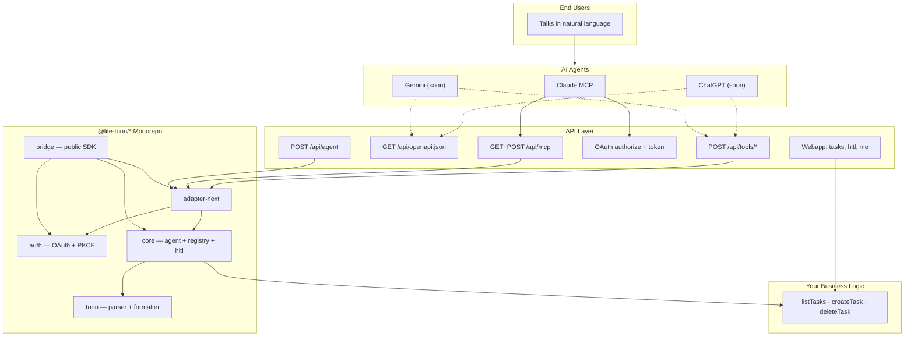

<div align="center">

# lite-toon

**Your web app, in every AI chat — starting with Claude.**

Turn any web application into something your users can drive with natural language. No API keys for them. No JSON for them. They just talk to the AI they already use every day.

Under the hood, lite-toon is a **framework-agnostic TypeScript SDK** that connects AI agents to your business logic — with **OAuth per-user auth**, **auto-generated schemas**, **Human-in-the-loop (HITL)** approval flows, and **TOON**, a wire format that shrinks payloads by up to **70%**.

> **⚠️ Early development** — lite-toon is under active development. **Supported today:** **Next.js App Router** and **Claude** (MCP over Streamable HTTP). **Not supported yet** (coming soon): ChatGPT, Gemini, and additional frameworks (Express, Hono, Edge).

<br/>

[](https://github.com/Luke-official/lite-toon/actions/workflows/ci.yml)
[](LICENSE)
[](https://www.typescriptlang.org/)
[](https://nextjs.org/)
[](https://modelcontextprotocol.io/)
[](https://oauth.net/2/)

<br/>

[Quick Start](#-quick-start) · [Documentation](docs/README.md) · [Connect Claude](#-connect-claude) · [TOON](#-what-is-toon) · [Architecture](#-architecture) · [API](#-api-reference) · [Security](#-security--demo-limitations) · [Contributing](CONTRIBUTING.md) · [Changelog](CHANGELOG.md)

</div>

---

## ✦ The pitch

> *"Plan my week — create the tasks I need, assign realistic priorities, and mark kickoff activities as in-progress."*

That's it. That's what your user types in Claude. lite-toon handles the rest: OAuth login, scoped permissions, capability routing, per-user state — and a response so compact your token bill notices.

```
User → Claude (MCP connector)
           ↓  OAuth (once)
           ↓  tools/call createTask, setPriority, setStatus
lite-toon → validate user → execute capability → JSON or TOON
           ↓
User ← "Done! I've created and updated your tasks for the week."
```

**One registry. One supported agent today. More platforms soon.**

| Status | Platform | How it connects | What lite-toon generates |
|---|---|---|---|
| ✅ **Supported** | **Claude** | MCP Streamable HTTP at `/api/mcp` + OAuth | MCP tool schemas + OAuth discovery |
| ✅ **Supported** | **Next.js App Router** | Route factories in `@lite-toon/adapter-next` | Thin API route handlers |
| ✅ **Supported** | **ChatGPT** | Custom GPT Actions + OAuth | OpenAPI 3.1 from your capabilities |
| 🔜 Not supported yet | **Gemini** | Extensions / Gems + OpenAPI | Gemini function declarations |
| 🔜 Coming soon | **Express / Hono / Edge** | Framework adapters | Same core, different transport |

---

## ✦ Why lite-toon?

| Pain | Fix |
|---|---|
| "We need an AI chatbot" | Your users already have one — plug into **theirs** |
| JSON eats tokens on every call | **TOON** compresses tabular data 40–70% |
| Who is this user? Whose data? | **OAuth 2.0 + PKCE** with per-user `ExecutionContext` |
| Multiple AI platforms = duplicate work | **One `CapabilityRegistry`**, many auto-exports (more agents coming) |
| Security nightmares | `SecurityGatekeeper` (scopes, rate limits) + **HITL** (human approval for destructive actions) |
| Framework lock-in | Pure TS core; **Next.js App Router** adapter ships today |

---

## ✦ What is TOON?

**TOON** (Token-Oriented Object Notation) is a compact, human-readable format built for agent round-trips. Arrays of objects become a typed header + rows — like CSV with a schema, designed for LLM consumption.

**JSON** — 142 chars:

```json
[
  { "id": "u1", "name": "Alice", "role": "admin" },
  { "id": "u2", "name": "Bob", "role": "user" },
  { "id": "u3", "name": "Charlie", "role": "editor" }
]
```

**TOON** — 98 chars (~31% smaller):

```
Users[3]{id, name, role}:
  u1, "Alice", admin
  u2, "Bob", user
  u3, "Charlie", editor
```

Use **TOON** on `/api/agent` for token-optimized direct integrations. Use **JSON** on MCP and (when available) `/api/tools/*` — because consumer AI platforms expect JSON.

---

## ✦ Architecture

Strict inward dependencies: adapters → core. Core imports nothing from frameworks.


```mermaid
flowchart TB
    subgraph users ["End Users"]
        U["Talks in natural language"]
    end

    subgraph agents ["AI Agents"]
        Claude["Claude MCP"]
        GPT["ChatGPT (soon)"]
        Gemini["Gemini (soon)"]
    end

    subgraph network ["API Layer"]
        Webapp["Webapp: tasks, hitl, me"]
        OpenAPI["GET /api/openapi.json"]
        Tools["POST /api/tools/*"]
        OAuth["OAuth authorize + token"]
        MCPhttp["GET+POST /api/mcp"]
        Agent["POST /api/agent"]
    end

    subgraph packages ["@lite-toon/* Monorepo"]
        Bridge["bridge — public SDK"]
        Adapter["adapter-next"]
        Auth["auth — OAuth + PKCE"]
        Core["core — agent + registry + hitl"]
        Toon["toon — parser + formatter"]
    end

    subgraph app ["Your Business Logic"]
        Cap["listTasks · createTask · deleteTask"]
    end

    U --> agents
    Claude --> MCPhttp
    Claude --> OAuth
    GPT -.-> OpenAPI
    GPT -.-> Tools
    Gemini -.-> OpenAPI
    Gemini -.-> Tools
    Tools --> Adapter
    MCPhttp --> Adapter
    Agent --> Adapter
    Webapp --> Cap
    Adapter --> Auth
    Adapter --> Core
    Core --> Toon
    Core --> Cap
    Bridge --> Adapter
    Bridge --> Auth
    Bridge --> Core
```

### Monorepo layout

```
lite-toon/
├── packages/
│   ├── toon/           @lite-toon/toon       — TOON parser & formatter
│   ├── core/           @lite-toon/core       — UniversalAgent, registry, security, hitl
│   ├── auth/           @lite-toon/auth       — OAuth 2.0 server + in-memory store
│   ├── adapter-next/   @lite-toon/adapter-next — Next.js route factories
│   └── bridge/         @lite-toon/bridge     — single import for app developers
│
└── apps/
    └── demo/           Next.js TaskFlow PoC + /connect setup page
```

---

## ✦ Quick Start

### Prerequisites

- **Node.js** 18+
- **npm** 10+ (workspaces)

### Clone & run

```bash
git clone https://github.com/Luke-official/lite-toon.git
cd lite-toon
npm install
cp .env.example apps/demo/.env.local   # optional
npm run build
npm run dev -w apps/demo
```

### Environment variables

Copy [`.env.example`](.env.example) to `apps/demo/.env.local` if you need overrides. All variables are optional for local development.

| Variable | Default | Used by |
|---|---|---|
| `OAUTH_CLIENT_ID` | `lite-toon-demo` | Demo OAuth server (`apps/demo/src/lib/auth.ts`) |
| `BASE_URL` | `http://localhost:3000` | `apps/demo/scripts/test-*.js` |

Open the demo:

| URL | What |
|---|---|
| [localhost:3000](http://localhost:3000) | TaskFlow — Kanban board, sign in, manage tasks |
| [localhost:3000/connect](http://localhost:3000/connect) | Developer guide — **Claude** connector setup |
| [localhost:3000/hitl](http://localhost:3000/hitl) | Human-in-the-Loop approval dashboard |

Sign in, add a task, or connect Claude via `/connect` and ask it to manage your board — both update the same task list.

### Run tests

With the dev server running:

```bash
npm run test:api    -w apps/demo   # TOON via /api/agent
npm run test:oauth  -w apps/demo   # full OAuth + tools flow
npm run test:mcp    -w apps/demo   # MCP initialize + tools/call
npm run test:tasks  -w apps/demo   # capability unit tests (no server needed)
```

---

## ✦ Documentation

Full documentation lives in [`docs/`](docs/README.md):

| Guide | Description |
|---|---|
| [Getting Started](docs/getting-started.md) | Install, run, test, first curl |
| [Study Guide](docs/guide/study-guide.md) | 8-day learning path for the entire codebase |
| [Architecture](docs/architecture/overview.md) | Monorepo layers, dependency rules, data flows |
| [Capabilities](docs/concepts/capabilities.md) | Define and register agent tools |
| [Human-in-the-Loop](docs/concepts/hitl.md) | HITL approval mechanism |
| [Next.js Integration](docs/integration/nextjs.md) | Wire lite-toon into your app |
| [API Reference](docs/reference/api.md) | Every endpoint, header, and example |
| [TOON Format](docs/concepts/toon.md) | Wire format specification |
| [OAuth](docs/concepts/oauth.md) | PKCE flow, tokens, scopes |
| [MCP](docs/concepts/mcp.md) | Claude integration protocol |
| [Security](docs/security/overview.md) | Production hardening checklist |

---

## ✦ Connect Claude

Full walkthrough: [`docs/integration/connect-agents.md`](docs/integration/connect-agents.md)

### Claude Chat (browser) with ngrok

1. Start the demo: `npm run dev -w apps/demo`
   - *This automatically starts Next.js and ngrok, printing your public URL.*
2. In Claude → **Settings → Connectors → Add custom connector**
3. MCP server URL: `https://<your-ngrok-host>/api/mcp`
4. Click **Connect** — Claude discovers OAuth via `/.well-known/oauth-protected-resource`
5. Sign in at `https://<your-ngrok-host>/login` when redirected
6. Ask Claude: *"What tasks do I have?"* then *"Create a new task for my weekly review"*
7. Open the board at the same ngrok URL (signed in) to see the tasks update

ngrok hosts matching `*.ngrok-free.app` and `*.ngrok.io` are allowed for OAuth redirects automatically.

---

## ✦ Connect ChatGPT

**ChatGPT Custom GPT — 5-minute setup:**

1. Run the demo: `npm run dev -w apps/demo`
   - *This automatically starts Next.js and ngrok.*
2. In ChatGPT → **Explore GPTs → Create → Configure → Add actions**
4. Import from URL: `https://<your-ngrok-host>/api/openapi.json`
   - ChatGPT reads the OpenAPI 3.1 document and discovers all capabilities automatically
5. Under **Authentication** → select **OAuth**, fill in:
   - Authorization URL: `https://<your-ngrok-host>/api/oauth/authorize`
   - Token URL: `https://<your-ngrok-host>/api/oauth/token`
   - Client ID: `lite-toon-demo` · Client secret: *(leave blank)*
   - Scope: `tasks:read tasks:write tasks:admin`
6. Click **Save** — ChatGPT will test the connection
7. Ask: *"What tasks are available?"* then *"Add a new task with high priority"*

---

## ✦ Examples

### 1. Register capabilities (with user context + HITL)

```typescript
import { UniversalAgent, Capability, ExecutionContext } from '@lite-toon/bridge';
import { OAuthServer, InMemoryAuthStore, InMemoryHitlStore } from '@lite-toon/bridge';

const oauth = new OAuthServer({
  store: new InMemoryAuthStore(),
  clientId: 'my-app',
  allowedRedirectUris: ['https://claude.ai/api/mcp/auth_callback'],
});

const deleteTask: Capability = {
  name: 'deleteTask',
  description: 'Permanently deletes a task. Requires human approval.',
  scopes: ['tasks:admin'],
  riskLevel: 'destructive', // ← triggers HITL flow
  schema: {
    type: 'object',
    properties: { id: { type: 'string' } },
    required: ['id'],
  },
  execute: async (params, context?: ExecutionContext) => {
    // Only reached after approval is granted at /hitl
    const deleted = db.delete(context!.userId, params.id);
    return { success: deleted };
  },
};

const agent = new UniversalAgent({
  tokenResolver: oauth,
  hitlStore: new InMemoryHitlStore(),
  capabilities: [deleteTask],
});
```

### 2. Wire Next.js routes (thin intercoms)

```typescript
// app/api/agent/route.ts       — TOON/JSON direct access
import { createNextAgentHandler } from '@lite-toon/bridge/next';
export const POST = createNextAgentHandler(agent);

// app/api/mcp/route.ts          — Claude MCP (Streamable HTTP, recommended)
import { createMCPStreamableHttpHandler } from '@lite-toon/bridge/next';
const handler = createMCPStreamableHttpHandler(agent);
export const GET = handler;
export const POST = handler;
```

### 3. Auto-export schemas (one registry, multiple formats)

```typescript
agent.registry.exportMcpTools();                  // → Claude MCP (supported)
agent.registry.exportOpenApiDocument({ ... });    // → ChatGPT (not supported yet)
agent.registry.exportGeminiFunctionDeclarations(); // → Gemini (not supported yet)
```

---

## ✦ API Reference

### Endpoints (demo app)

**Webapp** (session cookie) — humans in the browser:

| Method | Path | Auth | Description |
|---|---|---|---|
| `GET` | `/api/tasks` | Session | List tasks |
| `POST` | `/api/tasks` | Session | Create task |
| `PATCH` | `/api/tasks/[id]` | Session | Update task |
| `DELETE` | `/api/tasks/[id]` | Session | Delete task |
| `GET` | `/api/hitl/pending` | Session | List pending approvals |

**lite-toon bridge** (OAuth Bearer) — external AI assistants:

| Method | Path | Auth | Format | Consumer |
|---|---|---|---|---|
| `GET`+`POST` | `/api/mcp` | OAuth Bearer | JSON-RPC (Streamable HTTP) | **Claude** |
| `POST` | `/api/tools/{name}` | OAuth Bearer | JSON | ❌ Not supported (ChatGPT/Gemini) |
| `GET` | `/api/openapi.json` | — | OpenAPI 3.1 | ❌ Not supported (ChatGPT/Gemini) |
| `GET` | `/api/oauth/authorize` | Session | redirect | OAuth flow |
| `POST` | `/api/oauth/token` | — | JSON | OAuth PKCE exchange |

---

## ✦ Security & demo limitations

> **The demo app is a reference implementation, not a production auth system.** The SDK packages (`@lite-toon/core`, `@lite-toon/auth`, …) provide building blocks; you are responsible for hardening them before exposing real user data.

### Demo-only behaviors (do not deploy as-is)

| Area | Demo behavior | Production expectation |
|---|---|---|
| **Login** | Basic password + username | Real identity provider or credential verification |
| **OAuth tokens** | Opaque random tokens | Set `tokenSecret` for HMAC-signed tokens |
| **Auth store** | In-memory (`InMemoryAuthStore`) | `RedisAuthStore` from `@lite-toon/auth/redis` |
| **HITL store** | In-memory (`InMemoryHitlStore`) | Persistent store implementation |
| **Session cookie** | `httpOnly` + `sameSite: lax`, no `secure` flag | Set `secure: true` behind HTTPS |
| **Rate limiting** | In-memory, per process | Shared store (e.g. Redis) across instances |

### Production Deployment

The demo uses in-memory stores. Two drop-in upgrades harden it for production:

**1. Redis-backed auth store**

```typescript
import Redis from 'ioredis';
import { RedisAuthStore } from '@lite-toon/auth/redis';
import { OAuthServer } from '@lite-toon/auth';

const oauth = new OAuthServer({
  store: new RedisAuthStore(new Redis(process.env.REDIS_URL!)),
  clientId: process.env.OAUTH_CLIENT_ID!,
  // ...
});
```

**2. HMAC-signed access tokens**

Set `LITE_TOON_TOKEN_SECRET` to a 64-character hex string in `.env.local` to enable self-verifiable signed tokens. Token resolution no longer requires a store round-trip for valid, non-revoked tokens.

---

## ✦ Roadmap

- [x] Framework-agnostic core (`@lite-toon/core`, `@lite-toon/toon`)
- [x] Monorepo with `@lite-toon/*` workspaces + Turbo
- [x] Next.js App Router adapters (agent, MCP Streamable HTTP, OAuth)
- [x] OAuth 2.0 user auth with per-user isolated state + MCP OAuth discovery
- [x] Claude via MCP Streamable HTTP (`/api/mcp`)
- [x] Demo app + `/connect` developer guide
- [x] ChatGPT Custom GPT / Actions (OpenAPI 3.1 + `/api/tools/*`)
- [x] HMAC-SHA256 signed tokens (`tokenSecret` option)
- [x] `RedisAuthStore` adapter (`@lite-toon/auth/redis`)
- [x] Capability `riskLevel` field (`read` / `write` / `destructive`)
- [x] Human-in-the-Loop (HITL) approval layer for `destructive` capabilities
- [ ] Gemini Extensions / OpenAPI integration
- [ ] Publish `@lite-toon/bridge` to npm
- [ ] Express / Hono / Edge adapters

---

## ✦ Contributing

PRs welcome — bug fixes, adapters, docs, and tests.

See **[CONTRIBUTING.md](CONTRIBUTING.md)** for setup, dependency rules, code style, and the pull request workflow.

Please read our **[Code of Conduct](CODE_OF_CONDUCT.md)**. To report security issues privately, see **[SECURITY.md](SECURITY.md)**.

**Golden rule:** `packages/core` and `packages/toon` never import from adapters or frameworks. Demo code lives in `apps/demo/`.

Licensed under [MIT](LICENSE). See [CHANGELOG.md](CHANGELOG.md) for release history.

---

<div align="center">

**The age of AI agents is here. Your app should be in the conversation.**

lite-toon — *less tokens, more action — Claude first, more agents soon.*

<br/>

[⭐ Star us on GitHub](https://github.com/Luke-official/lite-toon) · [Read the connect guide](docs/integration/connect-agents.md)

</div>
