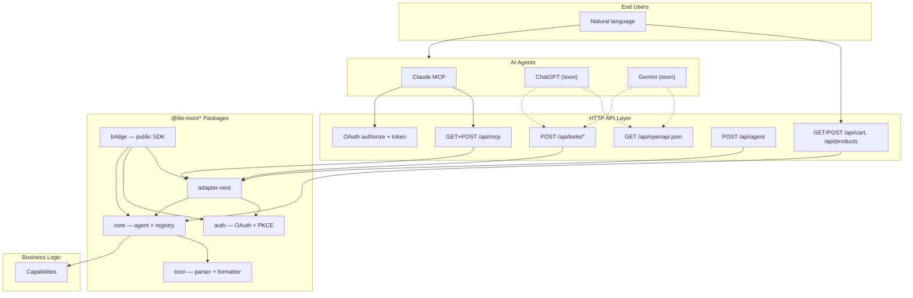
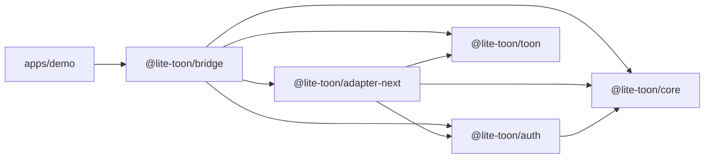
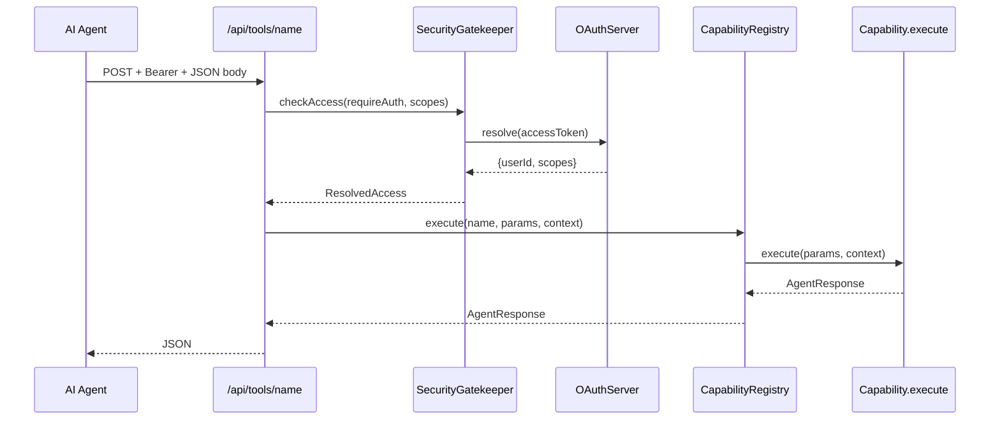
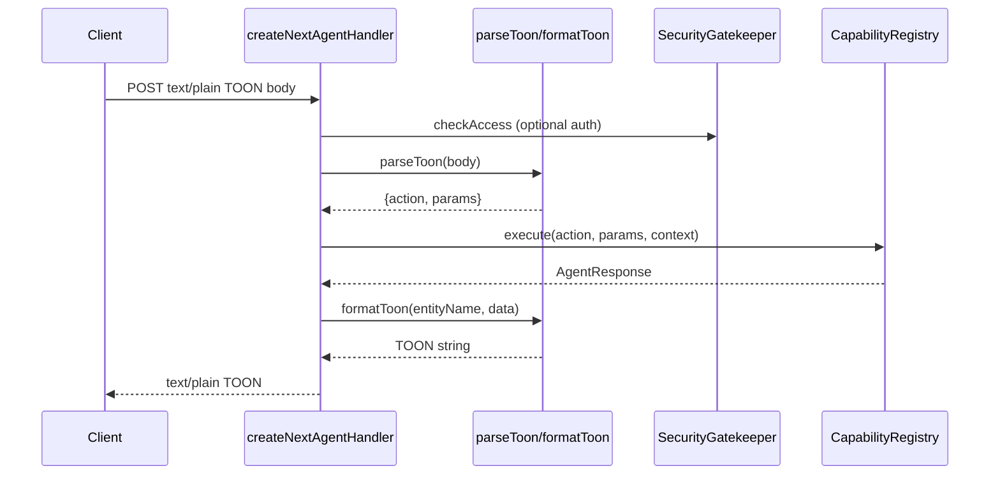

# Architecture

Deep dive into Lite-Toon's monorepo structure, dependency rules, runtime layers, and data flows.

> **Current scope:** Next.js App Router adapter + Claude MCP. ChatGPT and Gemini are **not supported yet** — coming soon.

## Design principles

1. **Framework-agnostic core** — `packages/core` and `packages/toon` have zero framework imports
2. **Adapters are thin** — transport logic lives in `packages/adapter-next`; demo routes are 3–10 lines
3. **One registry, many exports** — register capabilities once; MCP export is supported today; OpenAPI/Gemini exports are for future platforms (not supported yet)
4. **Inward dependencies only** — adapters → auth/core/toon; core never imports adapters
5. **TOON by default** — `/api/agent` uses TOON unless JSON is requested; MCP uses JSON-RPC

## Two channels

The demo app separates **human web traffic** from **agent bridge traffic**:

| Channel | Routes | Auth | Purpose |
|---|---|---|---|
| **Webapp** | `/api/products`, `/api/cart`, `/api/me` | Session cookie | Shop UI — humans browse and manage cart |
| **Bridge** | `/api/agent`, `/api/tools/*`, `/api/mcp`, OAuth | Bearer token (agents) or optional (agent) | AI agents discover and call capabilities |

Both channels call the same `CapabilityRegistry.execute()` — the webapp routes are thin wrappers that resolve the session cookie to `userId` and invoke capabilities directly.

## High-level diagram



## Monorepo layout

```
lite-toon/
├── package.json              Root workspace + Turbo scripts
├── turbo.json                Build pipeline (dependsOn: ^build)
├── tsconfig.json             Shared TypeScript base
│
├── packages/
│   ├── toon/                 @lite-toon/toon
│   │   └── src/
│   │       ├── parser.ts     TOON string → { entity, records }
│   │       ├── formatter.ts  objects → TOON string
│   │       ├── types.ts      ToonParseResult, ToonObject
│   │       └── index.ts
│   │
│   ├── core/                 @lite-toon/core
│   │   └── src/
│   │       ├── agent.ts      UniversalAgent hub
│   │       ├── registry.ts   CapabilityRegistry
│   │       ├── security.ts   SecurityGatekeeper + rate limiter
│   │       ├── openapi.ts    OpenAPI 3.1 document builder
│   │       ├── types.ts      Capability, ExecutionContext, …
│   │       └── index.ts
│   │
│   ├── auth/                 @lite-toon/auth
│   │   └── src/
│   │       ├── server.ts     OAuthServer (implements TokenResolver)
│   │       ├── store.ts      InMemoryAuthStore
│   │       ├── types.ts      AuthStore interface, OAuth types
│   │       └── index.ts
│   │
│   ├── adapter-next/         @lite-toon/adapter-next
│   │   └── src/
│   │       ├── rest/         createNextAgentHandler, createNextToolsHandler
│   │       ├── mcp/          createMCPStreamableHttpHandler, JSON-RPC core
│   │       ├── oauth/        OAuth route factories
│   │       ├── openapi.ts    createOpenApiSpecHandler
│   │       └── index.ts
│   │
│   └── bridge/               @lite-toon/bridge
│       └── src/
│           ├── index.ts      Re-exports core + toon + auth
│           ├── next.ts       Re-exports adapter-next
│           └── toon.ts       Re-exports toon (subpath)
│
└── apps/
    └── demo/                 @lite-toon/demo
        └── src/
            ├── agent.ts              UniversalAgent singleton
            ├── lib/auth.ts           OAuthServer config
            ├── demo/capabilities.ts  E-commerce business logic
            └── app/
                ├── page.tsx          Shop UI (product grid + cart)
                ├── connect/page.tsx  Merchant setup guide
                ├── login/page.tsx    OAuth login form
                └── api/              Thin route intercoms
                    ├── agent/route.ts
                    ├── cart/route.ts
                    ├── products/route.ts
                    ├── me/route.ts
                    ├── openapi.json/route.ts
                    ├── tools/[name]/route.ts
                    ├── oauth/
                    │   ├── authorize/route.ts
                    │   ├── token/route.ts
                    │   ├── login/route.ts
                    │   └── register/route.ts
                    └── mcp/route.ts
```

## Package dependency graph



| Package | Depends on | Must NOT depend on |
|---|---|---|
| `toon` | — | core, auth, adapters, next |
| `core` | — | toon (peer usage via adapters), auth, adapters, next |
| `auth` | `core` (TokenResolver types) | adapters, next |
| `adapter-next` | core, toon, auth | — (Next.js is expected) |
| `bridge` | all packages | — |
| `demo` | bridge | direct core imports (use bridge) |

## Runtime layers

### Layer 1 — Translation (`@lite-toon/toon`)

Serializes/deserializes the TOON wire format. Used by `createNextAgentHandler` for `/api/agent` request parsing and response formatting. See [TOON Format](../concepts/toon.md).

### Layer 2 — Platform (`@lite-toon/core` + `@lite-toon/auth`)

**UniversalAgent** bundles:

- `CapabilityRegistry` — register, execute, export schemas
- `SecurityGatekeeper` — rate limiting, token resolution, scope checks

**OAuthServer** implements `TokenResolver`:

- Login sessions (cookie-based)
- Authorization code + PKCE
- Bearer access tokens with scopes

### Layer 3 — Transport (`@lite-toon/adapter-next`)

Route factories that translate HTTP/MCP into core calls:

| Factory | Protocol |
|---|---|
| `createNextAgentHandler` | TOON/JSON REST |
| `createNextToolsHandler` | JSON REST per capability |
| `createMCPStreamableHttpHandler` | MCP Streamable HTTP (JSON-RPC 2.0) |
| `createOAuthAuthorizeHandler` | OAuth 2.0 redirect |
| `createOAuthTokenHandler` | OAuth token exchange |
| `createOAuthLoginHandler` | Demo session login |
| `createOAuthRegisterHandler` | Dynamic client registration |
| `createOpenApiSpecHandler` | OpenAPI 3.1 JSON |

### Layer 4 — Application (`apps/demo`)

- **Capabilities** — business logic in `demo/capabilities.ts`
- **Bridge routes** — thin delegates to adapter factories (`/api/agent`, `/api/tools/*`, `/api/mcp`, OAuth)
- **Webapp routes** — session-cookie routes that call `agent.registry.execute()` directly (`/api/cart`, `/api/products`, `/api/me`)
- **UI** — e-commerce shop with product grid and cart sidebar

## Request lifecycle (tools endpoint)



## Request lifecycle (/api/agent TOON)



## Schema export pipeline

One `CapabilityRegistry` feeds three export methods:

```
CapabilityRegistry
├── exportMcpTools()                    → Claude MCP tools/list
├── exportGeminiFunctionDeclarations()  → Gemini function calling
└── exportOpenApiDocument(options)      → ChatGPT Actions / Gemini Extensions
```

OpenAPI generates one `POST` path per capability at `/api/tools/{name}` with:

- `operationId` = capability name
- `requestBody` schema from `capability.schema`
- `security` from `capability.scopes`

## Build system

- **npm workspaces** — `apps/*`, `packages/*`
- **Turbo** — orchestrates `dev`, `build`, `lint` with `dependsOn: ["^build"]`
- **tsup** — bundles each package to `dist/`
- **Next.js** — builds `apps/demo` to `.next/`

Build order: `toon` → `core` → `auth` → `adapter-next` → `bridge` → `demo`

## Extension points

| Want to… | Extend |
|---|---|
| Add business logic | New `Capability` objects |
| Custom auth store | Implement `AuthStore` interface |
| Custom rate limiter | Implement `RateLimiterStore` interface |
| Custom token resolver | Implement `TokenResolver` (or use OAuthServer) |
| New framework | New package like `adapter-express` depending on core |
| Production tokens | Replace `randomToken()` in OAuthServer |

## Anti-patterns

| Don't | Do instead |
|---|---|
| Put business logic in route files | Register capabilities, keep routes thin |
| Import `@lite-toon/core` in app code | Import from `@lite-toon/bridge` |
| Import Next.js in `packages/core` | Keep core framework-agnostic |
| Hardcode tool paths | Use dynamic `[name]` route + registry |
| Use TOON for ChatGPT Actions | JSON on `/api/tools/*` (ChatGPT doesn't parse TOON) |

## Related docs

- [Packages](../reference/packages.md) — per-package API surface
- [Capabilities](../concepts/capabilities.md) — defining tools
- [Security](../security/overview.md) — production hardening
- [Study Guide](../guide/study-guide.md) — learning path
