# Capability Flows

> **Cheat sheet:** [capability-flows.md](../cheatsheets/capability-flows.md)

Per-capability sequence diagrams for every demo tool across all transports: **ChatGPT/Gemini** (`/api/tools`), **Claude MCP**, **TOON agent** (`/api/agent`), and the **demo UI** (`/api/demo`).

See also: [Capabilities guide](./capabilities.md) · [Capabilities cheat sheet](../cheatsheets/capabilities.md)

## Quick reference

| Capability | Scopes | Auth required | Params | Returns |
|---|---|---|---|---|
| `getProducts` | `cart:read` | Tools/MCP: yes. Agent: optional | none | `Product[]` |
| `getCart` | `cart:read` | Yes | none | `CartItem[]` |
| `addToCart` | `cart:write` | Yes | `productId`, `quantity` | `CartItem[]` |
| `clearCart` | `cart:write` | Yes | none | `[]` |

---

## `getProducts`

Returns the static product catalog. Does not touch per-user cart state.

### Via ChatGPT / Gemini (`POST /api/tools/getProducts`)

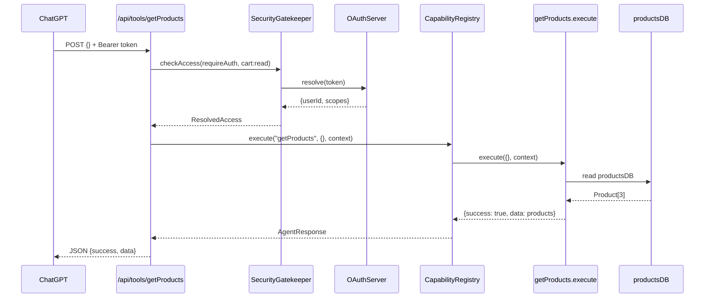

### Via Claude MCP (`tools/call`)

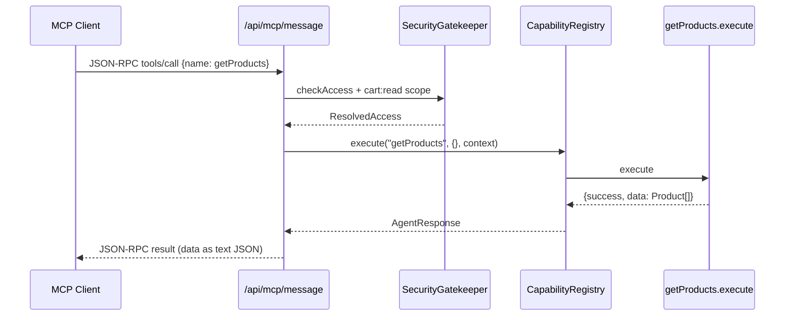

### Via TOON agent (`POST /api/agent`)

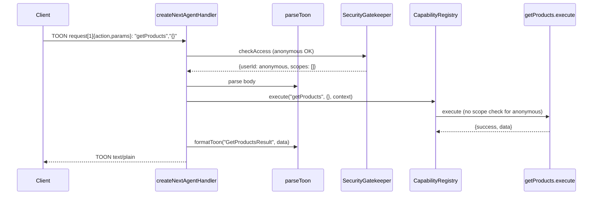

### Business logic (internal)

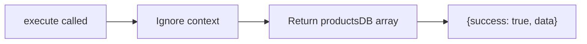

**Key file:** `apps/demo/src/demo/capabilities.ts` lines 64–72

### Example payloads

**Request (tools):**
```http
POST /api/tools/getProducts
Authorization: Bearer lt_abc123
Content-Type: application/json

{}
```

**Response:**
```json
{
  "success": true,
  "data": [
    { "id": "p1", "name": "Nike Shoes", "price": 120 },
    { "id": "p2", "name": "Adidas T-Shirt", "price": 35 },
    { "id": "p3", "name": "Puma Socks", "price": 15 }
  ]
}
```

**TOON response:**
```
GetProductsResult[3]{id, name, price}:
  p1, "Nike Shoes", 120
  p2, "Adidas T-Shirt", 35
  p3, "Puma Socks", 15
```

### Error paths

| Condition | Result |
|---|---|
| Missing Bearer on `/api/tools` | 401 `TOON_UNAUTHORIZED` |
| Token without `cart:read` | 403 `TOON_FORBIDDEN` |
| Rate limit exceeded | 429 `TOON_RATE_LIMIT_EXCEEDED` |

---

## `getCart`

Returns the authenticated user's cart from in-memory `cartsByUser` map.

### Via ChatGPT / Gemini

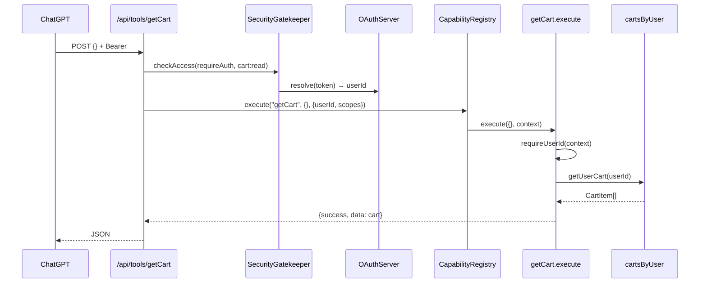

### Via TOON agent (authenticated)

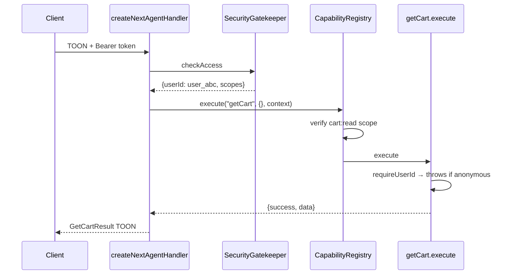

### Via demo UI

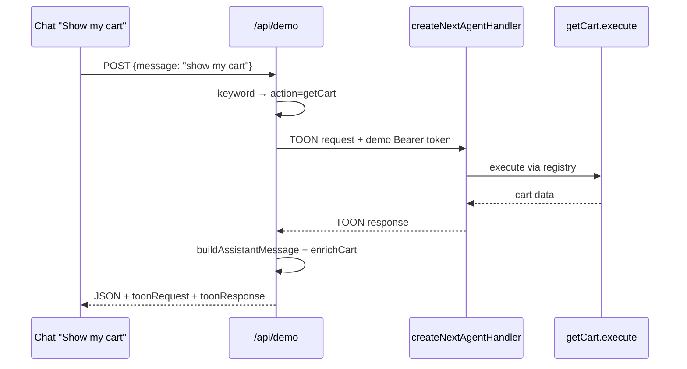

### Business logic (internal)

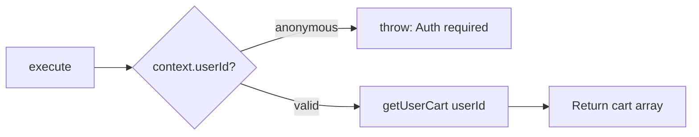

### Example response (empty cart)

```json
{ "success": true, "data": [] }
```

### Error paths

| Condition | Result |
|---|---|
| Anonymous call on agent | `throw` → `{success: false, message: "Authenticated user is required..."}` |
| Missing `cart:read` scope | 403 or registry scope error |
| User never added items | `{success: true, data: []}` (not an error) |

---

## `addToCart`

Adds or increments a product in the user's cart.

### Via ChatGPT / Gemini

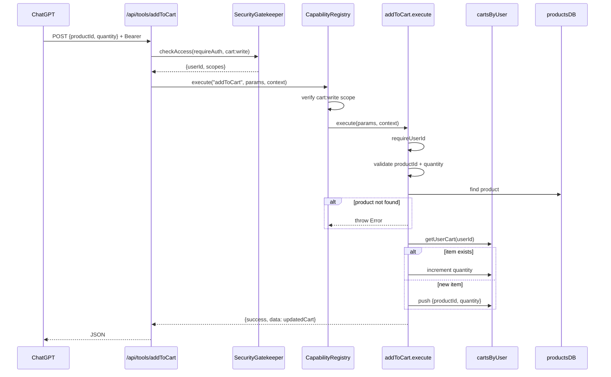

### Full end-to-end (user says "Add 2 Nike shoes")

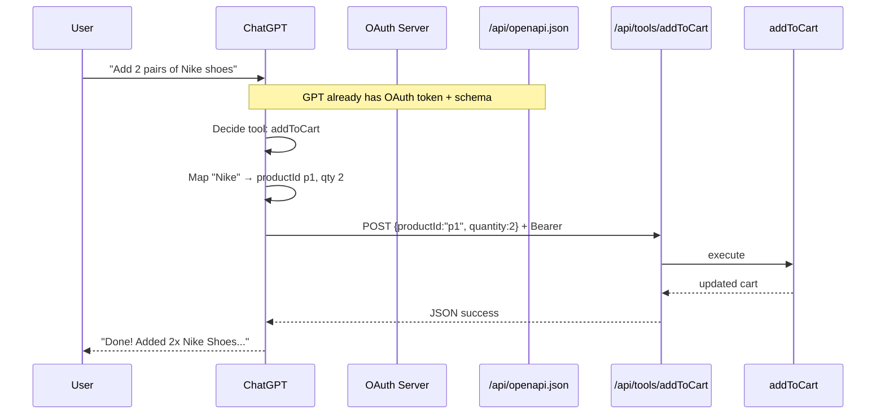

### Via MCP

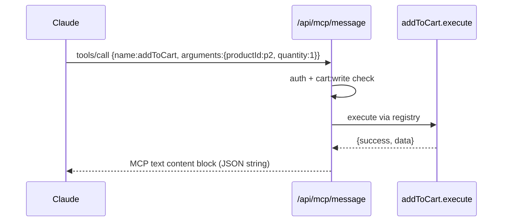

### Business logic (internal)

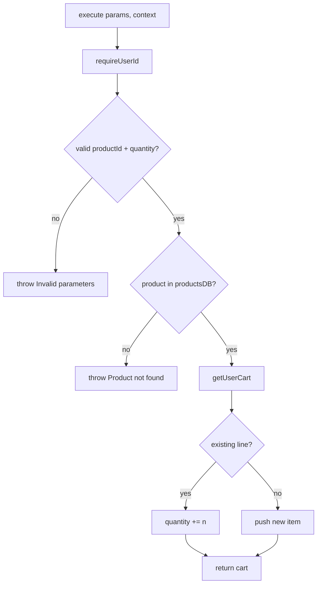

### Example request / response

```http
POST /api/tools/addToCart
Authorization: Bearer lt_xyz
Content-Type: application/json

{"productId": "p1", "quantity": 2}
```

```json
{
  "success": true,
  "data": [{ "productId": "p1", "quantity": 2 }]
}
```

### Error paths

| Condition | Message |
|---|---|
| Missing params | `Invalid parameters for addToCart.` |
| Unknown productId | `Product with ID xyz not found.` |
| Anonymous user | `Authenticated user is required for this operation.` |
| Missing `cart:write` | `Missing required scopes: cart:write` |

---

## `clearCart`

Empties the authenticated user's cart.

### Via ChatGPT / Gemini

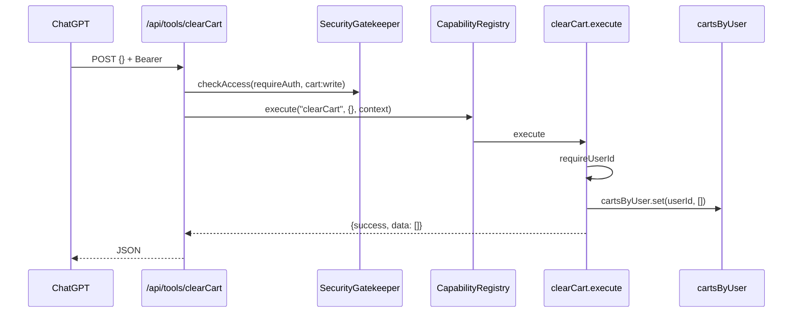

### Via TOON agent

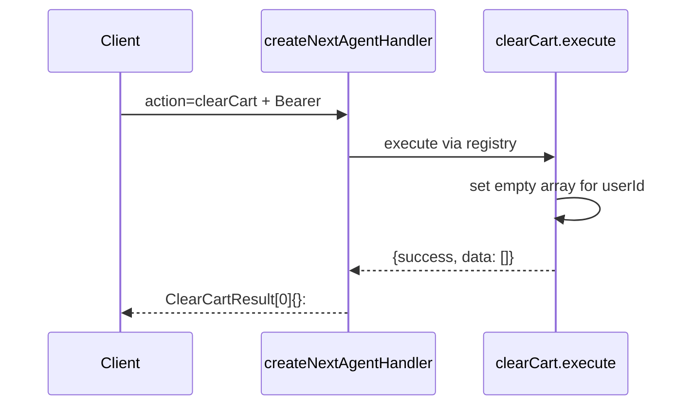

### Business logic (internal)

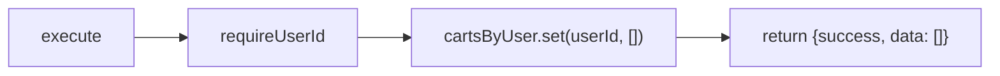

### Error paths

| Condition | Result |
|---|---|
| Anonymous | Auth required error |
| Already empty | `{success: true, data: []}` (idempotent) |
| Missing `cart:write` | 403 Forbidden |

---

## Cross-capability user journey

Typical shopping session:

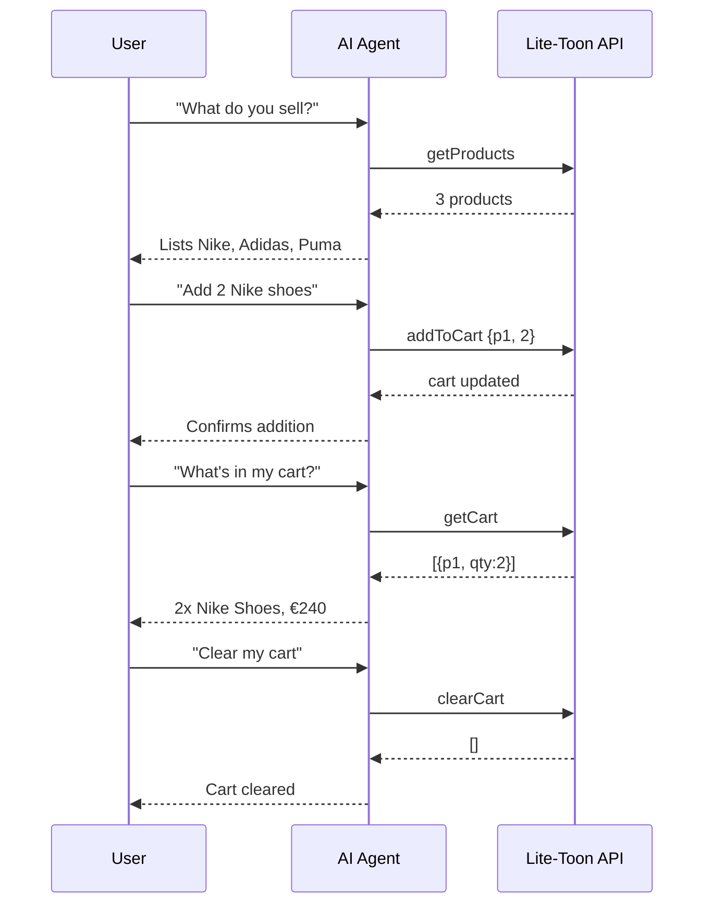

## Per-user isolation

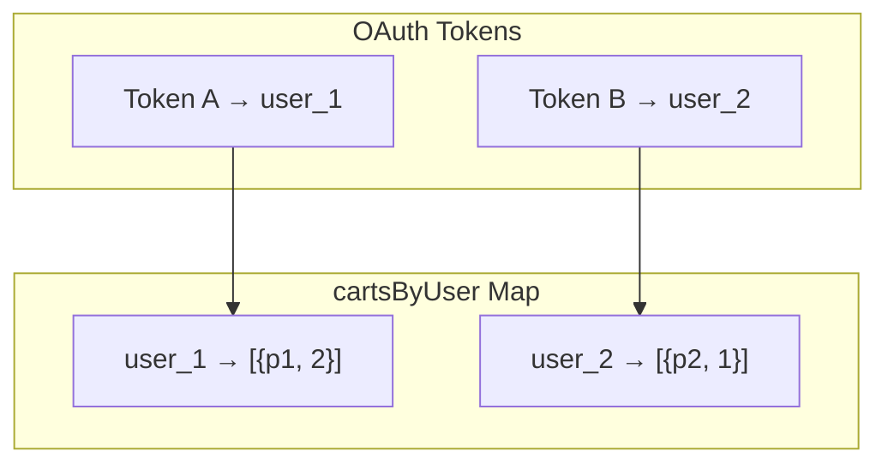

`getProducts` ignores userId. All cart capabilities use `context.userId` from token resolution — never from request body.

## Related

- [Capabilities guide](./capabilities.md)
- [API Reference](../reference/api.md)
- [Capabilities cheat sheet](../cheatsheets/capabilities.md)
- [Demo capabilities source](../../apps/demo/src/demo/capabilities.ts)
