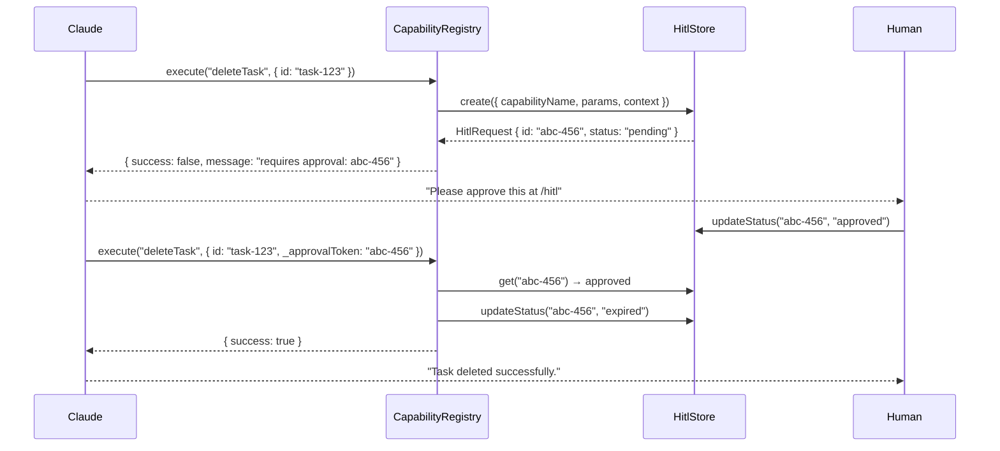

# Human-in-the-Loop (HITL)

HITL is lite-toon's safety mechanism for **irreversible AI actions**. When an AI agent attempts to execute a `destructive` capability, the registry intercepts the call, creates a pending approval request, and instructs the agent to wait for human confirmation before proceeding.

---

## Philosophy

AI agents should feel **powerful and autonomous** for everyday operations. HITL is the narrow exception — reserved only for actions that cannot be undone.

| Risk level | Example capabilities | HITL? |
|---|---|---|
| `read` | `listTasks`, `getTask` | ❌ Always autonomous |
| `write` | `createTask`, `updateTask`, `setStatus`, `bulkSetStatus` | ❌ Always autonomous |
| `destructive` | `deleteTask`, `nukeAllTasks` | ✅ Requires approval |

---

## How it works

### 1. Agent calls a destructive capability

Claude calls `tools/call` with `deleteTask`:

```json
{
  "method": "tools/call",
  "params": { "name": "deleteTask", "arguments": { "id": "task-123" } }
}
```

### 2. Registry intercepts and creates an approval request

`CapabilityRegistry.execute` detects `riskLevel: 'destructive'` and the presence of a `HitlStore`. It creates a pending `HitlRequest` and returns an error response to Claude:

```json
{
  "success": false,
  "message": "Action requires human approval. Approval ID: abc-456. Please ask the user to approve this action in their dashboard at /hitl, then retry with the approval token passed as '_approvalToken' in the parameters."
}
```

### 3. Claude reports back to the user

Claude relays this message: *"I need your approval before I can delete that task. Please go to your approval dashboard and confirm."*

### 4. Human reviews at `/hitl`

The dashboard polls `/api/hitl/pending` every 4 seconds and shows all pending requests with:
- The capability name (human-readable)
- The exact parameters the AI intended to call with
- A timestamp
- **Approve** / **Reject** buttons

### 5. Agent retries with approval token

After approval, Claude retries the tool call including `_approvalToken: "abc-456"` in the arguments. The registry validates the token, marks it as `expired` (preventing replay), and executes the capability.

---

## Sequence diagram



---

## Implementation

### 1. Define capabilities with `riskLevel: 'destructive'`

```ts
import { Capability } from '@lite-toon/core';

export const deleteTask: Capability = {
  name: 'deleteTask',
  description: 'Permanently deletes a task. Requires human approval.',
  scopes: ['tasks:admin'],
  riskLevel: 'destructive',   // ← triggers HITL
  schema: {
    type: 'object',
    properties: { id: { type: 'string' } },
    required: ['id'],
  },
  execute: async (params, context) => {
    // Only reached after approval is granted
    const deleted = db.delete(context!.userId, params.id);
    return { success: deleted };
  },
};
```

### 2. Pass a `HitlStore` to `UniversalAgent`

```ts
import { UniversalAgent, InMemoryHitlStore } from '@lite-toon/bridge';

const hitlStore = new InMemoryHitlStore();

export const agent = new UniversalAgent({
  tokenResolver: oauthServer,
  hitlStore,              // ← enables HITL interception
  capabilities: [...],
});
```

### 3. Expose the HITL API endpoints

In Next.js App Router:

```ts
// app/api/hitl/pending/route.ts
import { hitlStore } from '@/agent';
export async function GET() {
  return Response.json(await hitlStore.listPending());
}

// app/api/hitl/approve/route.ts
export async function POST(req: Request) {
  const { id } = await req.json();
  await hitlStore.updateStatus(id, 'approved');
  return Response.json({ success: true });
}

// app/api/hitl/reject/route.ts
export async function POST(req: Request) {
  const { id } = await req.json();
  await hitlStore.updateStatus(id, 'rejected');
  return Response.json({ success: true });
}
```

---

## Implementing a custom HitlStore

For production, replace `InMemoryHitlStore` with a persistent store (Redis, Postgres, etc.) by implementing the `HitlStore` interface:

```ts
import { HitlStore, HitlRequest, HitlStatus } from '@lite-toon/core';

export class RedisHitlStore implements HitlStore {
  async create(request: Omit<HitlRequest, 'id' | 'createdAt' | 'status'>): Promise<HitlRequest> {
    const id = crypto.randomUUID();
    const hitlRequest: HitlRequest = {
      ...request,
      id,
      status: 'pending',
      createdAt: Date.now(),
    };
    await redis.set(`hitl:${id}`, JSON.stringify(hitlRequest), { ex: 3600 });
    return hitlRequest;
  }

  async get(id: string): Promise<HitlRequest | null> {
    const raw = await redis.get(`hitl:${id}`);
    return raw ? JSON.parse(raw) : null;
  }

  async updateStatus(id: string, status: HitlStatus): Promise<boolean> {
    const req = await this.get(id);
    if (!req) return false;
    req.status = status;
    await redis.set(`hitl:${id}`, JSON.stringify(req), { ex: 3600 });
    return true;
  }

  async listPending(): Promise<HitlRequest[]> {
    // Implementation depends on your Redis setup (e.g., SCAN + filter)
    throw new Error('Not implemented — use SCAN or a secondary index');
  }
}
```

---

## Operating without a HitlStore

If no `hitlStore` is provided to `UniversalAgent`, `destructive` capabilities execute immediately without any approval gate. A warning is logged to the console:

```
[lite-toon] warn: Executing destructive capability 'deleteTask' without a HitlStore configured.
```

This is acceptable in development but **not recommended for production**.

---

## Related

- [Capabilities](./capabilities.md) — defining risk levels
- [Connect Agents](../integration/connect-agents.md) — end-to-end Claude setup
- [API Reference](../reference/api.md) — HITL endpoints
