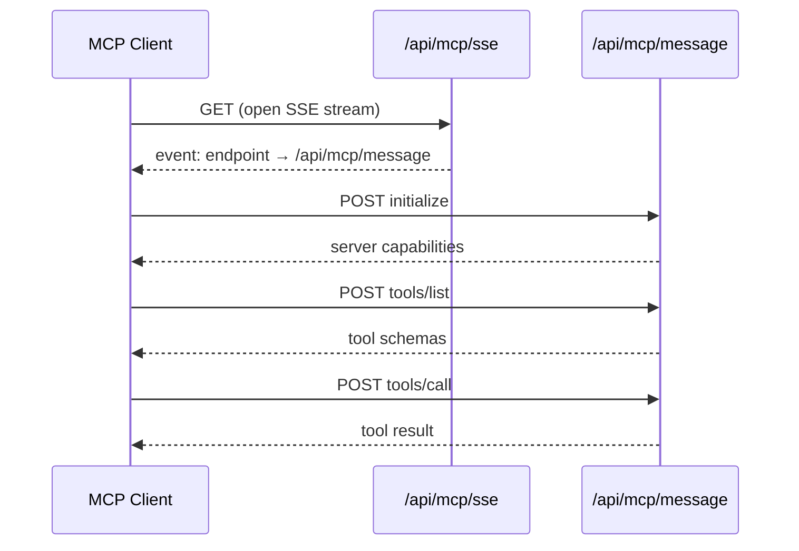

# MCP Integration

> **Cheat sheet:** [mcp.md](../cheatsheets/mcp.md)

Lite-Toon exposes a [Model Context Protocol](https://modelcontextprotocol.io/) (MCP) server so Claude and other MCP clients can discover and call your capabilities as tools.

## Transport

MCP over HTTP uses two endpoints:

| Method | Path | Role |
|---|---|---|
| `GET` | `/api/mcp/sse` | SSE stream — sends `endpoint` event with message URL |
| `POST` | `/api/mcp/message` | JSON-RPC 2.0 message handler |

Authentication: Bearer access token (same OAuth flow as `/api/tools/*`).

## Connection flow



### 1. Open SSE stream

```http
GET /api/mcp/sse
```

Response headers:

```
Content-Type: text/event-stream
Cache-Control: no-cache
Connection: keep-alive
```

First event:

```
event: endpoint
data: http://localhost:3000/api/mcp/message

```

The client uses this URL for all subsequent JSON-RPC messages.

### 2. Initialize

```http
POST /api/mcp/message
Authorization: Bearer <access_token>
Content-Type: application/json

{
  "jsonrpc": "2.0",
  "id": 1,
  "method": "initialize",
  "params": {
    "protocolVersion": "2024-11-05",
    "capabilities": {},
    "clientInfo": { "name": "my-client", "version": "1.0.0" }
  }
}
```

Response:

```json
{
  "jsonrpc": "2.0",
  "id": 1,
  "result": {
    "protocolVersion": "2024-11-05",
    "capabilities": { "tools": {} },
    "serverInfo": { "name": "lite-toon-mcp", "version": "0.1.0" }
  }
}
```

### 3. List tools

```json
{
  "jsonrpc": "2.0",
  "id": 2,
  "method": "tools/list",
  "params": {}
}
```

Response:

```json
{
  "jsonrpc": "2.0",
  "id": 2,
  "result": {
    "tools": [
      {
        "name": "getProducts",
        "description": "Returns the list of available products.",
        "inputSchema": { "type": "object", "properties": {} }
      },
      {
        "name": "addToCart",
        "description": "Adds a product to the user cart.",
        "inputSchema": {
          "type": "object",
          "properties": {
            "productId": { "type": "string" },
            "quantity": { "type": "number" }
          },
          "required": ["productId", "quantity"]
        }
      }
    ]
  }
}
```

Tools are auto-generated from `CapabilityRegistry.exportMcpTools()`.

### 4. Call a tool

```json
{
  "jsonrpc": "2.0",
  "id": 3,
  "method": "tools/call",
  "params": {
    "name": "addToCart",
    "arguments": { "productId": "p1", "quantity": 2 }
  }
}
```

Success response:

```json
{
  "jsonrpc": "2.0",
  "id": 3,
  "result": {
    "content": [
      { "type": "text", "text": "[{\"productId\":\"p1\",\"quantity\":2}]" }
    ],
    "isError": false
  }
}
```

Error response (capability failure):

```json
{
  "jsonrpc": "2.0",
  "id": 3,
  "result": {
    "content": [
      { "type": "text", "text": "Product with ID xyz not found." }
    ],
    "isError": true
  }
}
```

## Supported methods

| Method | Auth required | Description |
|---|---|---|
| `initialize` | No | Handshake, returns server info |
| `ping` | No | Health check, returns `{}` |
| `notifications/initialized` | No | Client ack → `204 No Content` |
| `tools/list` | No | Returns registered MCP tools |
| `tools/call` | **Yes** (Bearer + scopes) | Executes a capability |

Unsupported methods return JSON-RPC error `-32601 Method not found`.

## Authentication on tools/call

`createMCPMessageHandler` enforces:

1. `Authorization: Bearer <token>` header present
2. Token resolves to valid user via `OAuthServer`
3. User has all scopes required by the capability

Same rules as `POST /api/tools/{name}`.

## JSON-RPC error codes

| Code | When |
|---|---|
| `-32700` | Parse error (invalid JSON body) |
| `-32601` | Unknown method |
| `-32602` | Invalid params (missing tool name) |
| `-32603` | Internal server error |
| `-32001` | Unauthorized (missing/invalid token) |

## Response format note

MCP tool results return capability `data` as a **JSON string** inside `content[0].text`. This is intentional — MCP expects text content blocks, and JSON preserves structure for the calling model.

TOON is **not** used on MCP endpoints.

## SSE implementation details

File: `packages/adapter-next/src/sse.ts`

- Uses `TransformStream` for the response body
- Sends `endpoint` event immediately on connect
- Listens for `req.signal` abort to close writer (prevents leaks)
- Builds absolute message URL from `host` + `x-forwarded-proto` headers

## Wiring in Next.js

```typescript
// app/api/mcp/sse/route.ts
import { createMCPSseHandler } from '@lite-toon/bridge/next';
import { agent } from '@/agent';
export const GET = createMCPSseHandler(agent);

// app/api/mcp/message/route.ts
import { createMCPMessageHandler } from '@lite-toon/bridge/next';
import { agent } from '@/agent';
export const POST = createMCPMessageHandler(agent);
```

## Testing

```bash
npm run test:mcp -w @lite-toon/demo
```

Runs: OAuth login → token → `initialize` → `tools/list` → `tools/call addToCart`.

## Claude Desktop configuration (example)

Point your MCP client at:

- **SSE URL:** `https://your-domain/api/mcp/sse`
- **Auth:** OAuth Bearer token from the Lite-Toon OAuth flow

For local development with Claude, you typically need a public HTTPS tunnel (ngrok, Cloudflare Tunnel) since Claude cannot reach `localhost` directly.

## Comparison: MCP vs OpenAPI tools

| Aspect | MCP (`/api/mcp/*`) | OpenAPI (`/api/tools/*`) |
|---|---|---|
| Protocol | JSON-RPC 2.0 | REST POST per tool |
| Discovery | `tools/list` | `GET /api/openapi.json` |
| Transport | SSE + HTTP POST | HTTP POST |
| Primary consumer | Claude | ChatGPT, Gemini |
| Response format | MCP content blocks | `{ success, data }` JSON |
| Auth | Bearer + scopes | Bearer + scopes |

Both call the same `CapabilityRegistry.execute()`.

## Related

- [Connect Agents — Claude section](../integration/connect-agents.md#claude-mcp)
- [OAuth](./oauth.md)
- [API Reference](../reference/api.md#mcp-endpoints)
- [Capabilities](./capabilities.md)
