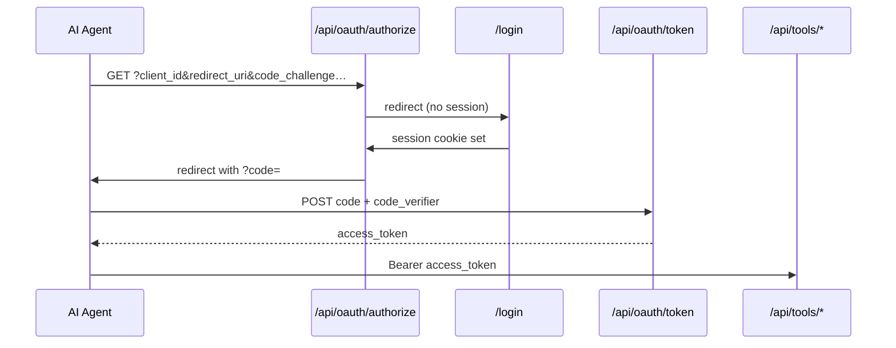

# OAuth & Authentication

> **Cheat sheet:** [oauth.md](../cheatsheets/oauth.md)

Lite-Toon ships an OAuth 2.0 authorization server with **PKCE** (Proof Key for Code Exchange) so AI agents can obtain per-user Bearer tokens without a client secret.

## Overview

| Concept | Implementation |
|---|---|
| User login | Session cookie (`lite_toon_session`) |
| Agent authorization | OAuth 2.0 authorization code + PKCE |
| API access | Bearer access token |
| Per-user context | `ExecutionContext { userId, scopes }` |
| Token resolution | `OAuthServer` implements `TokenResolver` |

## Actors



## Endpoints

| Method | Path | Purpose |
|---|---|---|
| `POST` | `/api/oauth/login` | Create user session (demo: username only) |
| `GET` | `/api/oauth/authorize` | Issue authorization code |
| `POST` | `/api/oauth/token` | Exchange code for access token (PKCE) |

## Demo configuration

File: `apps/demo/src/lib/auth.ts`

```typescript
export const oauthServer = new OAuthServer({
  store: new InMemoryAuthStore(),
  clientId: process.env.OAUTH_CLIENT_ID ?? 'lite-toon-demo',
  allowedRedirectUris: [
    'https://chat.openai.com/aip/oauth/callback',
    'https://chatgpt.com/aip/oauth/callback',
    'http://localhost:3000/oauth/callback',
  ],
});
```

| Setting | Demo value |
|---|---|
| Client ID | `lite-toon-demo` (public, not secret) |
| Scopes | `cart:read cart:write` |
| Redirect URIs | ChatGPT callbacks + localhost |

## PKCE flow (step by step)

### 1. Generate PKCE pair (agent-side)

```javascript
const codeVerifier = base64Url(crypto.randomBytes(32));
const codeChallenge = base64Url(sha256(codeVerifier));
```

### 2. User login (establish session)

```http
POST /api/oauth/login
Content-Type: application/json

{ "username": "alice" }
```

Response sets cookie:

```
Set-Cookie: lite_toon_session=<sessionId>; HttpOnly; SameSite=Lax; Path=/
```

### 3. Authorization request

```http
GET /api/oauth/authorize?
  client_id=lite-toon-demo&
  redirect_uri=http://localhost:3000/oauth/callback&
  response_type=code&
  scope=cart:read%20cart:write&
  state=random-state&
  code_challenge=<challenge>&
  code_challenge_method=S256
Cookie: lite_toon_session=<sessionId>
```

If no session → redirect to `/login?returnUrl=...`

On success → redirect to `redirect_uri?code=<auth_code>&state=...`

### 4. Token exchange

```http
POST /api/oauth/token
Content-Type: application/json

{
  "grant_type": "authorization_code",
  "code": "<auth_code>",
  "redirect_uri": "http://localhost:3000/oauth/callback",
  "client_id": "lite-toon-demo",
  "code_verifier": "<code_verifier>"
}
```

Response:

```json
{
  "access_token": "lt_...",
  "token_type": "Bearer",
  "expires_in": 3600,
  "scope": "cart:read cart:write"
}
```

### 5. Authenticated tool call

```http
POST /api/tools/addToCart
Authorization: Bearer <access_token>
Content-Type: application/json

{ "productId": "p1", "quantity": 2 }
```

## PKCE verification

In `OAuthServer.issueToken()`:

1. Consume authorization code (single use)
2. Verify `client_id`, `redirect_uri` match stored record
3. Compute `SHA-256(code_verifier)` as base64url
4. Compare to stored `code_challenge` (method must be `S256`)

## Scopes

Scopes are space-separated in the authorize URL:

```
scope=cart:read cart:write
```

| Scope | Grants |
|---|---|
| `cart:read` | `getProducts`, `getCart` |
| `cart:write` | `addToCart`, `clearCart` |

Enforcement happens at two levels:

1. **Gatekeeper** — `checkAccess({ requireAuth: true, requiredScopes })` on `/api/tools/*` and MCP
2. **Registry** — `execute()` checks capability scopes against `context.scopes`

## Token resolution

`OAuthServer.resolve(accessToken)` looks up the token in `AuthStore`:

```typescript
interface ResolvedToken {
  userId: string;
  scopes: string[];
}
```

Used by `SecurityGatekeeper` to build `ExecutionContext` for capability handlers.

## Session vs access token

| Mechanism | Lifetime | Purpose | Storage |
|---|---|---|---|
| Session cookie | 24h (default) | Browser login for OAuth authorize | `httpOnly` cookie |
| Authorization code | 5 min (default) | One-time exchange | Server memory |
| Access token | 1h (default) | Agent API calls | Agent holds Bearer token |

## AuthStore interface

For production, implement `AuthStore` (`packages/auth/src/types.ts`):

```typescript
interface AuthStore {
  upsertUser(username: string): Promise<AuthUser>;
  getUserById(userId: string): Promise<AuthUser | null>;
  saveAuthorizationCode(record: AuthorizationCodeRecord): Promise<void>;
  consumeAuthorizationCode(code: string): Promise<AuthorizationCodeRecord | null>;
  saveAccessToken(record: AccessTokenRecord): Promise<void>;
  getAccessToken(token: string): Promise<AccessTokenRecord | null>;
  saveSession(record: SessionRecord): Promise<void>;
  getSession(sessionId: string): Promise<SessionRecord | null>;
  deleteSession(sessionId: string): Promise<void>;
}
```

Demo uses `InMemoryAuthStore` — all data lost on restart.

## TTL defaults

| Record | Default TTL | Config key |
|---|---|---|
| Access token | 3600s (1h) | `tokenTtlSeconds` |
| Authorization code | 300s (5m) | `codeTtlSeconds` |
| Session | 86400s (24h) | `sessionTtlSeconds` |

## Demo shortcuts (not for production)

| Shortcut | Risk |
|---|---|
| Username-only login (no password) | Anyone can impersonate any username |
| `Math.random()` token generation | Predictable tokens |
| In-memory store | No persistence, no clustering |
| No `secure` cookie flag | Session hijack over HTTP |

See [Security](../security/overview.md) for the production checklist.

## Testing

```bash
npm run test:oauth -w @lite-toon/demo
```

Performs full flow: login → authorize → token → addToCart → getCart.

## ChatGPT OAuth configuration

In Custom GPT Actions:

| Field | Value |
|---|---|
| Authorization URL | `https://your-domain/api/oauth/authorize` |
| Token URL | `https://your-domain/api/oauth/token` |
| Client ID | `lite-toon-demo` |
| Scope | `cart:read cart:write` |
| PKCE | Enable |

## Related

- [Connect Agents](../integration/connect-agents.md)
- [Security](../security/overview.md)
- [API Reference — OAuth endpoints](../reference/api.md#oauth-endpoints)
- [Capabilities — scopes](./capabilities.md#oauth-scopes)
