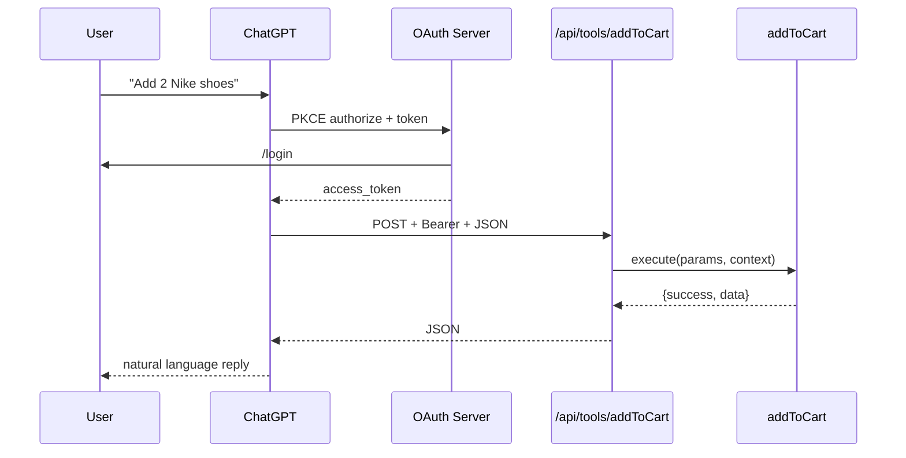
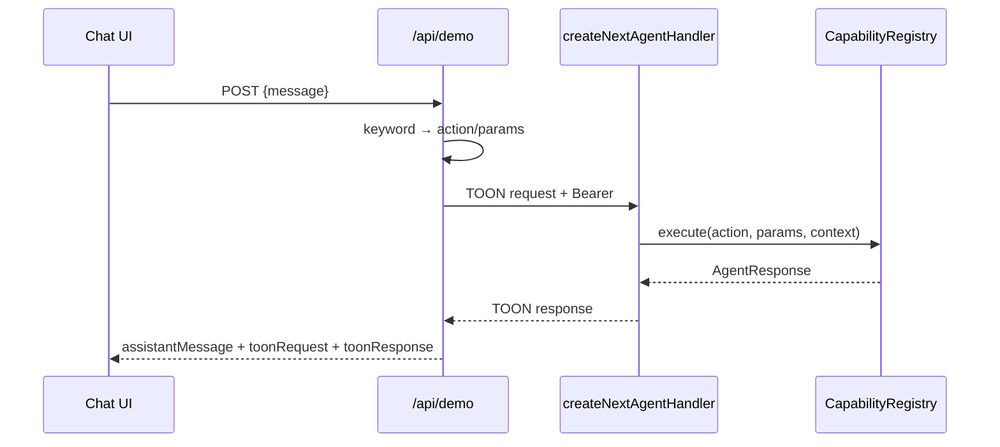

# Study Guide

> **Cheat sheet:** [study-guide.md](../cheatsheets/study-guide.md)

A structured path to understand every aspect of the Lite-Toon codebase — from TOON serialization to OAuth flows and MCP JSON-RPC.

## What you are learning

Lite-Toon is a **Universal Agent API Layer**: middleware that lets AI agents call your web app's business logic securely. The SDK handles:

- **Capability registration** — named tools with JSON Schema and OAuth scopes
- **Schema export** — one registry → OpenAPI (ChatGPT/Gemini), MCP (Claude), TOON (direct)
- **Authentication** — OAuth 2.0 + PKCE with per-user `ExecutionContext`
- **Wire format** — TOON for token-efficient agent round-trips

## Prerequisites

Complete [Getting Started](./getting-started.md) first: clone, build, run demo, pass all three test scripts.

## The three rings

```
┌─────────────────────────────────────────┐
│  Transport (adapters)                   │  How agents connect (REST, MCP, OAuth)
│  ┌───────────────────────────────────┐  │
│  │  Platform (core + auth)           │  │  Registry, security, token resolution
│  │  ┌─────────────────────────────┐  │  │
│  │  │  Your app (capabilities)    │  │  │  Business logic you write
│  │  └─────────────────────────────┘  │  │
│  └───────────────────────────────────┘  │
└─────────────────────────────────────────┘
```

---

## Day 1 — Observe the system running

### Goals

- See TOON in the UI System Log
- Understand the demo's four capabilities
- Map URLs to agent platforms

### Activities

1. Open `http://localhost:3000` and add Nike shoes to cart
2. Open `http://localhost:3000/connect` — note OpenAPI and OAuth URLs
3. Open `http://localhost:3000/api/openapi.json` — see auto-generated paths

### Files to skim

| File | Why |
|---|---|
| `apps/demo/src/demo/capabilities.ts` | Mock e-commerce business logic |
| `apps/demo/src/agent.ts` | Wires OAuth + capabilities into `UniversalAgent` |
| `apps/demo/src/app/api/agent/route.ts` | Thin route (3 lines) |

### Checkpoint

You should be able to answer:

- What are the four demo capabilities?
- Which endpoint uses TOON vs JSON?
- What is the demo OAuth client ID?

**Answers:** `getProducts`, `getCart`, `addToCart`, `clearCart` · `/api/agent` = TOON, `/api/tools/*` and MCP = JSON · `lite-toon-demo`

---

## Day 2 — TOON format

### Goals

- Read and write TOON payloads by hand
- Trace parse → execute → format round-trip

### Read

- [TOON Format](../concepts/toon.md) (full spec)
- `packages/toon/src/formatter.ts`
- `packages/toon/src/parser.ts`

### Exercise

Run `npm run test:api -w @lite-toon/demo` and compare request/response to the spec.

Write a TOON request for `addToCart` with `productId: "p1"` and `quantity: 2`:

```
request[1]{action, params}:
  "addToCart", "{\"productId\":\"p1\",\"quantity\":2}"
```

Note: params are often JSON-encoded strings inside TOON rows when sent via `/api/agent`.

### Trace in code

`packages/adapter-next/src/rest.ts`:

1. `parseToon(rawBody)` → extract `action` and `params`
2. `agent.registry.execute(action, params, context)`
3. `formatToon(entityName, records)` → response

### Checkpoint

- What is the header line format?
- When are string values quoted?
- What does an empty result look like?

**Answers:** `EntityName[count]{col1, col2}:` · strings always double-quoted, with `\"` escapes · `EntityName[0]{}:`

---

## Day 3 — Core platform (registry + security)

### Goals

- Understand `Capability` interface and scope enforcement
- Trace `SecurityGatekeeper.checkAccess()` for anonymous vs authenticated calls

### Read

- `packages/core/src/types.ts` — all interfaces
- `packages/core/src/registry.ts` — register, execute, export
- `packages/core/src/security.ts` — rate limit + token resolution
- `packages/core/src/agent.ts` — hub wiring

### Key interfaces

```typescript
interface Capability {
  name: string;
  description: string;       // becomes AI tool description
  schema?: Record<string, any>;  // JSON Schema for params
  scopes?: string[];       // OAuth scopes required
  execute(params, context?): Promise<AgentResponse>;
}

interface ExecutionContext {
  userId: string;
  agentId: string;
  scopes: string[];
}
```

### Exercise

In `registry.ts`, find where scope checks happen. What happens if a user has `cart:read` but calls `addToCart` (requires `cart:write`)?

**Answer:** `execute()` returns `{ success: false, message: "Missing required scopes: cart:write" }`.

In `security.ts`, find the rate limit key. What headers influence it?

**Answer:** `x-agent-id` (preferred), else `x-forwarded-for` IP, else `"anonymous"`. Default: 100 requests per 60 seconds.

### Checkpoint

- What does `UniversalAgent` bundle?
- When is anonymous access allowed?
- What is `TokenResolver`?

---

## Day 4 — OAuth and per-user isolation

### Goals

- Trace full PKCE authorization code flow
- Understand session cookies vs Bearer tokens
- See per-user cart isolation

### Read

- [OAuth & Authentication](../concepts/oauth.md)
- `packages/auth/src/server.ts`
- `packages/auth/src/store.ts`
- `apps/demo/src/lib/auth.ts`

### Exercise

Run `npm run test:oauth -w @lite-toon/demo` and match each step to code:

| Step | Endpoint | Code location |
|---|---|---|
| Login | `POST /api/oauth/login` | `createOAuthLoginHandler` |
| Authorize | `GET /api/oauth/authorize` | `createOAuthAuthorizeHandler` |
| Token | `POST /api/oauth/token` | `createOAuthTokenHandler` |
| Tool call | `POST /api/tools/addToCart` | `createNextToolsHandler` |

### Per-user carts

In `capabilities.ts`, `cartsByUser` is a `Map<string, CartItem[]>`. The `userId` comes from token resolution in the gatekeeper, passed as `ExecutionContext`.

### Checkpoint

- What cookie name holds the login session?
- How is PKCE verified?
- What TTL defaults apply to tokens, codes, sessions?

**Answers:** `lite_toon_session` · SHA-256 of `code_verifier` must match stored `code_challenge` · 3600s / 300s / 86400s

---

## Day 5 — Transport adapters

### Goals

- Understand each route factory and which agent platform uses it
- Compare auth requirements across endpoints

### Read

- [API Reference](../reference/api.md)
- `packages/adapter-next/src/rest.ts` — `/api/agent`
- `packages/adapter-next/src/tools.ts` — `/api/tools/{name}`
- `packages/adapter-next/src/mcp-message.ts` — MCP JSON-RPC
- `packages/adapter-next/src/sse.ts` — MCP SSE
- `packages/adapter-next/src/oauth.ts` — OAuth routes
- `packages/adapter-next/src/openapi.ts` — OpenAPI export

### Endpoint matrix

| Endpoint | Auth | Format | Consumer |
|---|---|---|---|
| `POST /api/agent` | Optional Bearer | TOON or JSON | Direct integrations |
| `POST /api/tools/{name}` | Required Bearer + scopes | JSON | ChatGPT, Gemini |
| `POST /api/mcp/message` | Required Bearer + scopes | JSON-RPC | Claude |
| `GET /api/mcp/sse` | None | SSE | Claude (discovery) |
| `GET /api/openapi.json` | None | OpenAPI 3.1 | GPT Actions import |
| `GET /api/oauth/authorize` | Session cookie | redirect | OAuth |
| `POST /api/oauth/token` | None | JSON | OAuth PKCE |
| `POST /api/demo` | Auto demo token | JSON + TOON log | Interactive UI |

### Exercise

Read `apps/demo/src/app/api/demo/route.ts` — the `/api/demo` route simulates an AI:

1. Keyword-matches user message
2. Builds TOON request via `formatToon()`
3. Calls `createNextAgentHandler` internally
4. Returns assistant message + raw TOON for the System Log

This is the best file for understanding the full pipeline without external agents.

### Checkpoint

- Why does ChatGPT use JSON, not TOON?
- What MCP methods are supported?
- How does Claude discover the message URL?

---

## Day 6 — Schema export (one registry, three formats)

### Goals

- See how capabilities become OpenAPI paths, MCP tools, and Gemini declarations

### Read

- `packages/core/src/registry.ts` — `exportMcpTools()`, `exportOpenApiDocument()`
- `packages/core/src/openapi.ts` — OpenAPI builder
- `apps/demo/src/app/api/openapi.json/route.ts` — live export

### Exercise

Compare these three outputs for `addToCart`:

1. `GET /api/openapi.json` → path `/api/tools/addToCart`
2. MCP `tools/list` → tool with `inputSchema`
3. `registry.exportGeminiFunctionDeclarations()` → same schema, different wrapper

### Checkpoint

- Where do capability `description` fields end up?
- How are scopes reflected in OpenAPI?

**Answers:** MCP `description`, OpenAPI `summary`/`description`, GPT tool docs · `security: [{ oauth2: [scopes] }]` per operation

---

## Day 7 — Security and production readiness

### Goals

- Know every demo-only shortcut
- Plan what to replace before production

### Read

- [Security](../security/overview.md)
- README section "Security & demo limitations"

### Demo-only behaviors

| Area | Demo | Production |
|---|---|---|
| Login | Username only | Real IdP / credentials |
| Tokens | `Math.random()` | `crypto.randomBytes()` or JWT |
| Store | In-memory | Redis / database |
| Rate limit | Per-process memory | Shared store |
| `/api/agent` | Anonymous allowed | Require auth for sensitive caps |
| `/api/demo` | Auto-issues tokens | Remove or protect |

### Checkpoint

List three things you must change before deploying with real user data.

---

## Day 8 — Build your own capability

### Goals

- Add a hypothetical `removeFromCart` capability (on paper)
- Know every file that would need updating

### Read

- [Capabilities Guide](../concepts/capabilities.md)
- [Next.js Integration](../integration/nextjs.md)

### Checklist for a new capability

1. Define `Capability` object with `name`, `description`, `schema`, `scopes`, `execute`
2. Register in `UniversalAgent` constructor or `agent.registry.register()`
3. No route changes needed — OpenAPI/MCP/tools auto-discover via registry
4. Update tests if applicable

### Checkpoint

Would you need to edit `apps/demo/src/app/api/tools/[name]/route.ts` to add a tool?

**Answer:** No. The dynamic `[name]` route dispatches to any registered capability.

---

## Reference: request flow diagrams

### ChatGPT → add to cart



### Demo UI → TOON round-trip



---

## Glossary

| Term | Definition |
|---|---|
| **Capability** | A named, schema-described function agents can call |
| **Registry** | `CapabilityRegistry` — stores and executes capabilities, exports schemas |
| **Gatekeeper** | `SecurityGatekeeper` — rate limits, resolves tokens, enforces scopes |
| **ExecutionContext** | `{ userId, agentId, scopes }` passed to every `execute()` |
| **TokenResolver** | Interface to map Bearer token → user identity (implemented by `OAuthServer`) |
| **TOON** | Token-Oriented Object Notation — compact tabular wire format |
| **Bridge** | `@lite-toon/bridge` — public SDK import path |
| **Thin route** | Next.js route file that only delegates to an adapter factory |
| **Intercom** | Demo term for a route with no business logic |

---

## Legacy code note

A pre-monorepo `src/` directory exists at the repo root with duplicate core/adapter files. **Active code lives in `packages/*` and `apps/demo/*`.** Ignore root `src/` unless tracing git history.

---

## Further reading

- [Documentation index](../README.md)
- [Packages reference](../reference/packages.md)
- [Demo app walkthrough](./demo-app.md)
- [CONTRIBUTING.md](../CONTRIBUTING.md)
