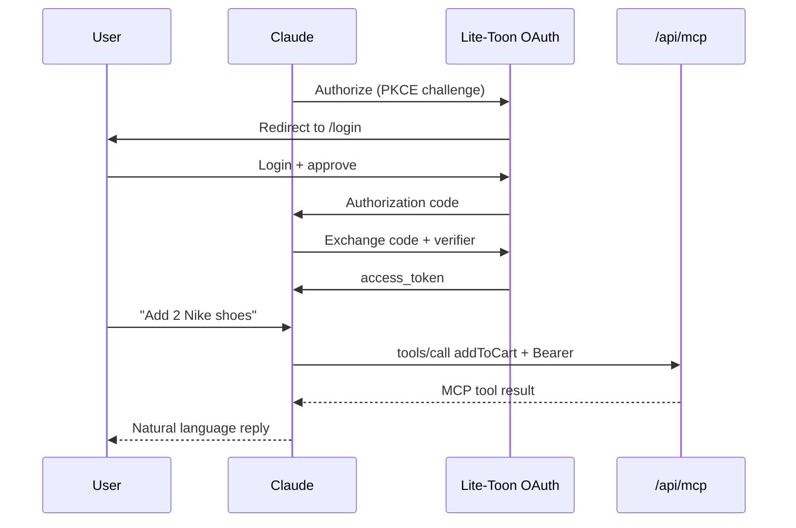

# Connect AI Agents

Guide for merchants and developers connecting **Claude** to a Lite-Toon-powered application.

> **Supported today:** Claude via MCP Streamable HTTP (`/api/mcp`) on **Next.js App Router**.  
> **Not supported yet:** ChatGPT and Gemini. They will be added in a future release — do not attempt to connect them today.

End users shop in your webapp normally. They talk to Claude (or another supported assistant) for natural-language interactions — they never configure APIs, OAuth, or TOON themselves.

## Prerequisites

- Lite-Toon app deployed and reachable (or local demo running)
- **HTTPS required** for Claude Chat in the browser (use [ngrok](https://ngrok.com/) or Cloudflare Tunnel for local testing)
- Open `/connect` on your deployment for copy-paste endpoint URLs

## Bridge endpoints

Replace `your-domain` with your deployment URL.

| Resource | URL |
|---|---|
| **MCP (Streamable HTTP)** | `GET`+`POST https://your-domain/api/mcp` |
| OAuth authorize | `GET https://your-domain/api/oauth/authorize` |
| OAuth token | `POST https://your-domain/api/oauth/token` |
| OAuth register (DCR) | `POST https://your-domain/api/oauth/register` |
| Protected resource metadata | `GET https://your-domain/.well-known/oauth-protected-resource` |
| Authorization server metadata | `GET https://your-domain/.well-known/oauth-authorization-server` |
| Developer setup guide | `GET https://your-domain/connect` |

**Demo client ID:** `lite-toon-demo`  
**Scopes:** `cart:read cart:write`

## OAuth flow (Claude)



### Steps

1. Agent generates PKCE `code_verifier` and `code_challenge` (S256)
2. Agent redirects user to `/api/oauth/authorize` with `client_id`, `redirect_uri`, `scope`, `code_challenge`
3. User logs in at `/login` if no session exists
4. User is redirected back to agent with `code`
5. Agent exchanges `code` + `code_verifier` at `/api/oauth/token`
6. Agent stores `access_token` and sends `Authorization: Bearer` on all tool calls

Each user gets an isolated cart keyed by their OAuth `userId` — the same cart the webapp shows when signed in with the same username.

See [OAuth & Authentication](../concepts/oauth.md) for technical details.

---

## Claude (MCP) — supported

Claude connects via the **Model Context Protocol** at `/api/mcp` (Streamable HTTP).

### Claude Chat (browser) with ngrok

1. Start the demo: `npm run dev:clean`
2. Expose HTTPS: `ngrok http 3000`
3. In Claude → **Settings → Connectors → Add custom connector**
4. MCP server URL: `https://<your-ngrok-host>/api/mcp`
5. Click **Connect** — Claude discovers OAuth via `/.well-known/oauth-protected-resource`
6. Sign in at `https://<your-ngrok-host>/login` when redirected (use a username you'll remember)
7. Ask Claude: *"What products do you have?"* then *"Add 2 Nike shoes to my cart"*
8. Open the shop at the same ngrok URL (signed in) to see the cart update

ngrok hosts matching `*.ngrok-free.app` and `*.ngrok.io` are allowed for OAuth redirects automatically.

### Supported MCP methods

| Method | Auth | Description |
|---|---|---|
| `initialize` | No | Protocol handshake |
| `ping` | No | Health check |
| `tools/list` | No | Discover available tools |
| `tools/call` | **Yes** | Execute a capability |

### Example tools/call

```json
{
  "jsonrpc": "2.0",
  "id": 1,
  "method": "tools/call",
  "params": {
    "name": "addToCart",
    "arguments": { "productId": "p1", "quantity": 2 }
  }
}
```

### Troubleshooting

| Problem | Solution |
|---|---|
| Claude cannot connect to localhost | Use ngrok or deploy to a public HTTPS URL |
| OAuth redirect fails | Ensure ngrok URL is HTTPS; check `allowedRedirectUris` |
| tools/call returns 401 | Complete OAuth connector flow in Claude settings |
| Empty tools list | Verify capabilities are registered on the agent |
| Cart not visible in browser | Sign in at `/login` with the same username used during Claude OAuth |

---

## ChatGPT — not supported yet

ChatGPT (Custom GPT / Actions) integration is **not available today**. It will be added in a future release.

---

## Gemini — not supported yet

Gemini (Extensions / OpenAPI) integration is **not available today**. It will be added in a future release.

---

## Local development with ngrok

Claude Chat cannot reach `localhost`. Tunnel your dev server:

```bash
# Terminal 1
npm run dev:clean

# Terminal 2
ngrok http 3000
```

Use the ngrok HTTPS URL as the MCP server host:

- MCP: `https://abc123.ngrok.io/api/mcp`
- Login: `https://abc123.ngrok.io/login`

## Testing without Claude

With the dev server running:

```bash
# MCP Streamable HTTP + OAuth discovery
npm run test:mcp -w @lite-toon/demo

# TOON direct access
npm run test:api -w @lite-toon/demo
```

Or use the shop UI at `http://localhost:3000` — sign in and add products with **Add to cart** buttons.

## Platform comparison

| Feature | Claude *(supported)* | ChatGPT *(not yet)* | Gemini *(not yet)* | Direct `/api/agent` |
|---|---|---|---|---|
| Discovery | MCP `tools/list` | — | — | Manual |
| Protocol | JSON-RPC on `/api/mcp` | — | — | TOON or JSON |
| Auth | OAuth PKCE + Bearer | — | — | Optional Bearer |
| Response format | MCP text content | — | — | TOON (default) |
| Per-user context | Yes | — | — | Yes (with token) |

## Architecture note

- **Webapp** — session-authenticated REST (`/api/cart`, `/api/products`) for human users
- **Bridge** — JSON-RPC on `/api/mcp` for Claude; TOON on `/api/agent` for direct integrations
- Business logic lives in **capabilities**; bridge schemas are generated automatically
- One capability update → webapp and all bridge transports stay in sync

## Related

- [OAuth & Authentication](../concepts/oauth.md)
- [MCP Integration](../concepts/mcp.md)
- [API Reference](../reference/api.md)
- [Next.js Integration](./nextjs.md)
- [Security](../security/overview.md)
