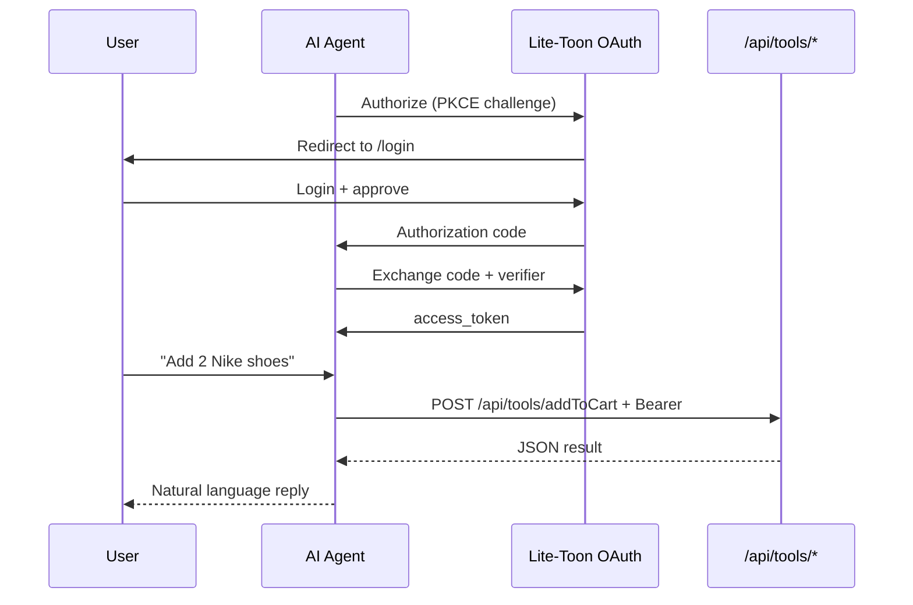

# Connect AI Agents

> **Cheat sheet:** [connect-agents.md](../cheatsheets/connect-agents.md)

Guide for merchants and developers connecting **ChatGPT**, **Gemini**, and **Claude** to a Lite-Toon-powered application.

End users only talk to their AI assistant — they never configure APIs, OAuth, or TOON.

## Prerequisites

- Lite-Toon app deployed and reachable (or local demo running)
- **HTTPS required** for ChatGPT and most cloud agents (use [ngrok](https://ngrok.com/) or Cloudflare Tunnel for local testing)
- Open `/connect` on your deployment for copy-paste endpoint URLs

## Shared endpoints

Replace `your-domain` with your deployment URL.

| Resource | URL |
|---|---|
| OpenAPI spec | `GET https://your-domain/api/openapi.json` |
| OAuth authorize | `GET https://your-domain/api/oauth/authorize` |
| OAuth token | `POST https://your-domain/api/oauth/token` |
| Tool execution | `POST https://your-domain/api/tools/{capabilityName}` |
| MCP SSE | `GET https://your-domain/api/mcp/sse` |
| MCP messages | `POST https://your-domain/api/mcp/message` |
| Merchant guide | `GET https://your-domain/connect` |

**Demo client ID:** `lite-toon-demo`  
**Scopes:** `cart:read cart:write`

## OAuth flow (all agents)

Every agent platform uses the same OAuth 2.0 + PKCE flow:



### Steps

1. Agent generates PKCE `code_verifier` and `code_challenge` (S256)
2. Agent redirects user to `/api/oauth/authorize` with `client_id`, `redirect_uri`, `scope`, `code_challenge`
3. User logs in at `/login` if no session exists
4. User is redirected back to agent with `code`
5. Agent exchanges `code` + `code_verifier` at `/api/oauth/token`
6. Agent stores `access_token` and sends `Authorization: Bearer` on all tool calls

Each user gets an isolated cart keyed by their OAuth `userId`.

See [OAuth & Authentication](../concepts/oauth.md) for technical details.

---

## ChatGPT (Custom GPT / Actions)

ChatGPT uses the **OpenAPI spec** to discover tools and **OAuth** for per-user auth.

### Setup (5 minutes)

1. Open [ChatGPT GPT Builder](https://chat.openai.com/gpts/editor)
2. Create a new Custom GPT
3. Go to **Configure → Actions → Create new action → Import from URL**
4. Paste: `https://your-domain/api/openapi.json`
5. Set **Authentication** to **OAuth**:
   | Field | Value |
   |---|---|
   | Client ID | `lite-toon-demo` |
   | Client Secret | *(leave empty — PKCE, no secret)* |
   | Authorization URL | `https://your-domain/api/oauth/authorize` |
   | Token URL | `https://your-domain/api/oauth/token` |
   | Scope | `cart:read cart:write` |
   | Token Exchange Method | Default (POST request) |
6. Enable **PKCE** if prompted
7. Click **Test** — complete OAuth login when prompted
8. Publish and share the GPT link

### GPT instructions (suggested)

Add to the GPT's system instructions:

```
You are a shopping assistant for the Lite-Toon demo store.
Use getProducts to show available items.
Use addToCart to add items (productId from getProducts, quantity as number).
Use getCart to show the current cart.
Use clearCart to empty the cart.
Always confirm actions with the user.
```

### Example user prompts

- *"What products do you have?"*
- *"Add 2 pairs of Nike shoes to my cart"*
- *"Show my cart"*
- *"Clear my cart"*

### How it works under the hood

1. GPT reads OpenAPI spec → discovers `POST /api/tools/addToCart`
2. GPT calls tool with JSON body: `{ "productId": "p1", "quantity": 2 }`
3. Lite-Toon validates Bearer token + `cart:write` scope
4. `addToCart` capability executes with user's `ExecutionContext`
5. JSON response returned → GPT formats natural language reply

### Troubleshooting

| Problem | Solution |
|---|---|
| OAuth redirect fails | Ensure `redirect_uri` is in `allowedRedirectUris` in auth config |
| 401 on tool calls | Re-authenticate OAuth in GPT settings |
| 403 Forbidden | Token missing `cart:write` scope — re-auth with correct scopes |
| Schema import fails | Verify `/api/openapi.json` is reachable over HTTPS |
| Localhost not working | ChatGPT cannot reach localhost — use ngrok |

---

## Claude (MCP)

Claude connects via the **Model Context Protocol** using SSE + JSON-RPC.

### Setup

1. Configure your MCP client with SSE URL: `https://your-domain/api/mcp/sse`
2. Client reads `endpoint` event → discovers message URL
3. Complete OAuth to obtain Bearer access token
4. Send JSON-RPC to message URL with `Authorization: Bearer <token>`

### Supported MCP methods

| Method | Auth | Description |
|---|---|---|
| `initialize` | No | Protocol handshake |
| `ping` | No | Health check |
| `tools/list` | No | Discover available tools |
| `tools/call` | **Yes** | Execute a capability |

### Example tools/call

```json
{
  "jsonrpc": "2.0",
  "id": 1,
  "method": "tools/call",
  "params": {
    "name": "addToCart",
    "arguments": { "productId": "p1", "quantity": 2 }
  }
}
```

### Claude Desktop config (example)

```json
{
  "mcpServers": {
    "lite-toon-shop": {
      "url": "https://your-domain/api/mcp/sse"
    }
  }
}
```

OAuth must be completed separately to obtain the Bearer token for `tools/call`.

See [MCP Integration](../concepts/mcp.md) for the full protocol reference.

### Troubleshooting

| Problem | Solution |
|---|---|
| SSE connection drops | Check reverse proxy supports long-lived connections |
| tools/call returns -32001 | Missing or expired Bearer token |
| Empty tools list | Verify capabilities are registered on the agent |

---

## Gemini (OpenAPI / Extensions)

Gemini uses the **same OpenAPI spec** as ChatGPT.

### Setup

1. Open [Google AI Studio](https://aistudio.google.com/) or create a Gemini Gem
2. Import OpenAPI from: `https://your-domain/api/openapi.json`
3. Configure OAuth:
   | Field | Value |
   |---|---|
   | Authorization URL | `https://your-domain/api/oauth/authorize` |
   | Token URL | `https://your-domain/api/oauth/token` |
   | Client ID | `lite-toon-demo` |
   | Scopes | `cart:read cart:write` |
4. Complete OAuth when prompted
5. Publish and share

### Function declarations

Gemini function declarations are auto-generated from the same capability registry:

```typescript
agent.registry.exportGeminiFunctionDeclarations();
```

These match MCP tool schemas — same `name`, `description`, and JSON Schema parameters.

---

## Local development with ngrok

ChatGPT and Claude cannot reach `localhost`. Tunnel your dev server:

```bash
# Terminal 1
npm run dev:clean

# Terminal 2
ngrok http 3000
```

Use the ngrok HTTPS URL:

- OpenAPI: `https://abc123.ngrok.io/api/openapi.json`
- OAuth authorize: `https://abc123.ngrok.io/api/oauth/authorize`
- Add ngrok URL to `allowedRedirectUris` in `apps/demo/src/lib/auth.ts`

## Testing without external agents

With the dev server running:

```bash
# TOON direct access
npm run test:api -w @lite-toon/demo

# Full OAuth + ChatGPT-style tools
npm run test:oauth -w @lite-toon/demo

# MCP JSON-RPC
npm run test:mcp -w @lite-toon/demo
```

Or use the built-in chat UI at `http://localhost:3000` — it simulates an AI via keyword matching and shows TOON payloads in the System Log.

## Platform comparison

| Feature | ChatGPT | Claude | Gemini | Direct `/api/agent` |
|---|---|---|---|---|
| Discovery | OpenAPI import | MCP tools/list | OpenAPI import | Manual |
| Protocol | REST JSON | JSON-RPC | REST JSON | TOON or JSON |
| Auth | OAuth PKCE | OAuth Bearer | OAuth PKCE | Optional Bearer |
| Response format | JSON | MCP text content | JSON | TOON (default) |
| Per-user context | Yes | Yes | Yes | Yes (with token) |

All platforms execute the same capabilities through the same `CapabilityRegistry`.

## Architecture note

- **JSON** on `/api/tools/*` and MCP — required by consumer AI platforms
- **TOON** on `/api/agent` — for token-efficient direct integrations
- Business logic lives in **capabilities**; schemas are generated automatically
- One registry update → all platforms get the new tool

## Related

- [OAuth & Authentication](../concepts/oauth.md)
- [MCP Integration](../concepts/mcp.md)
- [API Reference](../reference/api.md)
- [Next.js Integration](./nextjs.md)
- [Security](../security/overview.md)
