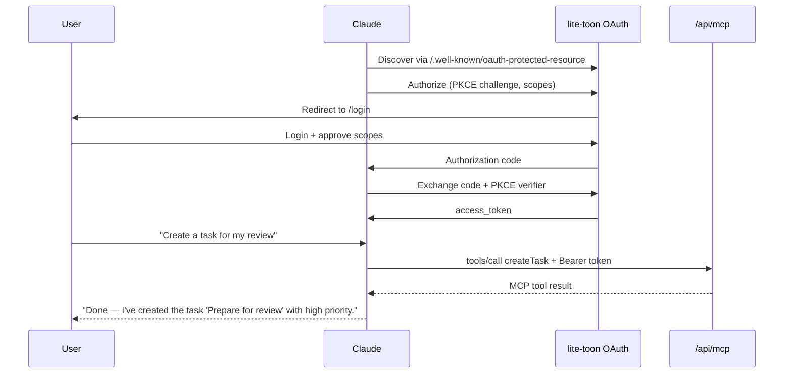

# Connect Claude to Your App

A step-by-step guide to connect **Claude** to a lite-toon–powered application using [MCP Connectors](https://claude.ai/customize/connectors/).

> **Supported today:** Claude via MCP Streamable HTTP (`/api/mcp`) — any framework adapter (Next.js, Hono, Express, Fastify, Stdio).  
> **Not yet supported:** ChatGPT Actions and Gemini Extensions.

---

## How it works

Claude connects to your app over the **Model Context Protocol (MCP)**. lite-toon exposes a single endpoint (`/api/mcp`) that Claude uses to discover tools, authenticate users via OAuth, and call capabilities.

```
Claude ──→ POST /api/mcp  (MCP Streamable HTTP)
                │
                ├─ tools/list  → discover your capabilities
                └─ tools/call  → execute a capability
                        │
                        ↓
                UniversalAgent.registry.execute()
                        │
                        ├─ read/write → runs immediately
                        └─ destructive → HITL approval at /hitl
```

Your web app and Claude call **the same capability functions** — only the transport layer differs.

---

## Prerequisites

| Item | Requirement |
|---|---|
| lite-toon app | Running on a reachable HTTPS URL |
| Claude account | [claude.ai](https://claude.ai) — free tier works |
| HTTPS Tunnel | Required for Claude Chat (use [ngrok](https://ngrok.com) for local dev) |

> **Local testing:** Claude Chat cannot reach `localhost` directly. You must expose your dev server over HTTPS using ngrok or a similar tunnel.

---

## Step 1 — Run the demo

From the **monorepo root**:

```bash
# Install all workspaces
npm install

# Build all packages first (required once)
npm run build

# Start the demo app
npm run dev -w apps/demo
```

The demo starts at `http://localhost:3000`.

> **Windows PowerShell note:** Do not use `&&` — it is not supported in PowerShell 5.1. Run commands on separate lines or use `;`.

---

## Step 2 — Find your HTTPS URL

When you ran `npm run dev -w apps/demo`, a background script automatically launched ngrok for you.

Check your terminal output for a large banner that looks like this:

```
━━━━━━━━━━━━━━━━━━━━━━━━━━━━━━━━━━━━━━━━━━━━━━━━━━━━━━━━━━━━
 🌍 NGROK TUNNEL READY: https://abc12345.ngrok-free.app
    Use this URL for your Claude MCP Connector
━━━━━━━━━━━━━━━━━━━━━━━━━━━━━━━━━━━━━━━━━━━━━━━━━━━━━━━━━━━━
```

Use this public URL as your base URL for the rest of this guide.

---

## Step 3 — Register an account

Open `https://<your-ngrok-host>/login` and register with a username and password. This creates your user identity — **the same account Claude will act on your behalf**.

---

## Step 4 — Add a connector in Claude

1. Go to [claude.ai/customize/connectors](https://claude.ai/customize/connectors/)
2. Click **Add connector**
3. In the **MCP Server URL** field, paste:
   ```
   https://<your-ngrok-host>/api/mcp
   ```
4. Click **Connect**

Claude automatically discovers OAuth via the `/.well-known/oauth-protected-resource` metadata endpoint — no manual configuration needed.

---

## Step 5 — Authorize OAuth

Claude will open a popup redirecting to your app's login screen.

1. Log in with the **same username** you registered in Step 3
2. Review the OAuth consent screen — it lists the scopes Claude is requesting:
   - `tasks:read` — list and view tasks
   - `tasks:write` — create, update, and change task status
   - `tasks:admin` — delete tasks (triggers HITL approval)
3. Click **Approve**
4. Claude confirms the connection is active

---

## Step 6 — Talk to Claude

The connector is live. Open a new Claude conversation and try:

```
What tasks do I have?
```

Claude will call `listTasks` and summarize your board. From here, Claude can act autonomously on your tasks without asking for confirmation on every step.

---

## Demo prompts

Copy any of these into Claude to see the full capability set in action:

### Autonomous (no approval needed)

```
I have a product launch on Friday. Plan my week — create all the tasks 
I'll need, assign realistic priorities, and mark anything that sounds 
like a kickoff or planning activity as "in-progress".
```

```
I just finished standup. Mark all my in-progress tasks as done and 
create a new task: "Prepare for tomorrow's review" with high priority.
```

```
Look at all my tasks and re-prioritize: anything due in the next 2 days 
should be high priority, everything else medium or low.
```

```
Go through my tasks. Add the tag "docs" to anything documentation-related, 
and "devops" to anything infrastructure-related.
```

```
Give me a daily summary: how many tasks are in each status, which 
high-priority ones are overdue, and what I should focus on first.
```

### Destructive — triggers HITL approval

```
Delete the standup scheduling task — I don't need it anymore.
```

When Claude calls `deleteTask` or `nukeAllTasks`, it receives an approval-required response. It will tell you to visit `/hitl` to approve before it can proceed.

Open `https://<your-ngrok-host>/hitl` in your browser, review the request, and click **Approve** or **Reject**.

---

## OAuth scopes reference

| Scope | Capabilities unlocked |
|---|---|
| `tasks:read` | `listTasks`, `getTask` |
| `tasks:write` | `createTask`, `updateTask`, `setStatus`, `setPriority`, `bulkSetStatus`, `bulkSetPriority` |
| `tasks:admin` | `deleteTask`, `nukeAllTasks` — requires HITL approval |

Grant only the scopes you want Claude to have access to. If you omit `tasks:admin`, Claude can still read and modify tasks but can never delete them.

---

## Available MCP methods

| Method | Auth required | Description |
|---|---|---|
| `initialize` | No | Protocol handshake |
| `ping` | No | Health check |
| `tools/list` | No | Returns all registered capabilities as MCP tools |
| `tools/call` | **Yes** | Executes a capability with the provided arguments |

### Example `tools/call` payload

```json
{
  "jsonrpc": "2.0",
  "id": 1,
  "method": "tools/call",
  "params": {
    "name": "createTask",
    "arguments": {
      "title": "Write release notes",
      "priority": "high",
      "tags": ["docs"],
      "dueDate": "2025-09-10"
    }
  }
}
```

---

## Understanding the dual-channel pattern

lite-toon exposes your app on two separate channels simultaneously:

| Channel | Endpoint | Auth | Used by |
|---|---|---|---|
| Human REST API | `/api/tasks/*` | Session cookie | Browser, mobile, voice apps |
| AI agent API | `/api/mcp` | OAuth Bearer | Claude, any MCP client |

Both channels call the **same capability functions** in your app. You write business logic once; lite-toon handles the transport, auth, schema generation, and HITL for both.

---

## OAuth flow (technical detail)


```mermaid
sequenceDiagram
    participant User
    participant Claude
    participant OAuth as lite-toon OAuth
    participant MCP as /api/mcp

    Claude->>OAuth: Discover via /.well-known/oauth-protected-resource
    Claude->>OAuth: Authorize (PKCE challenge, scopes)
    OAuth->>User: Redirect to /login
    User->>OAuth: Login + approve scopes
    OAuth->>Claude: Authorization code
    Claude->>OAuth: Exchange code + PKCE verifier
    OAuth->>Claude: access_token
    User->>Claude: "Create a task for my review"
    Claude->>MCP: tools/call createTask + Bearer token
    MCP-->>Claude: MCP tool result
    Claude-->>User: "Done — I've created the task 'Prepare for review' with high priority."
```

---

## Troubleshooting

| Problem | Solution |
|---|---|
| Claude cannot connect | Ensure your URL is HTTPS; `localhost` is not reachable from Claude Chat |
| OAuth popup doesn't open | Pop-up blocker? Allow popups for claude.ai |
| OAuth redirect fails | Check that your ngrok URL is HTTPS and still active |
| `tools/call` returns 401 | Re-authorize: remove and re-add the connector in Claude settings |
| Empty tools list | Ensure `npm run build` was run before starting dev — package dist files must exist |
| HITL approval not firing | Confirm `hitlStore` is passed to `UniversalAgent` and `tasks:admin` scope was granted |
| Tasks don't appear on board | Sign in at `/login` with the **same username** used during OAuth |
| ngrok session expired | Restart ngrok and update the MCP URL in Claude connector settings |

---

## Testing without Claude

With the dev server running, you can verify the MCP endpoint directly:

```bash
# MCP protocol smoke test (initialize + tools/list)
npm run test:mcp -w apps/demo

# Capability unit tests (no server needed)
npm run test:tasks -w apps/demo

# OAuth flow + tools/call integration test
npm run test:oauth -w apps/demo
```

---

## Related

- [Getting Started](../getting-started.md) — run the demo in 5 minutes
- [OAuth & Authentication](../concepts/oauth.md) — PKCE flow details
- [MCP Integration](../concepts/mcp.md) — protocol reference
- [Capabilities](../concepts/capabilities.md) — adding your own tools
- [Human-in-the-Loop](../concepts/hitl.md) — HITL approval system
- [API Reference](../reference/api.md) — all endpoints
