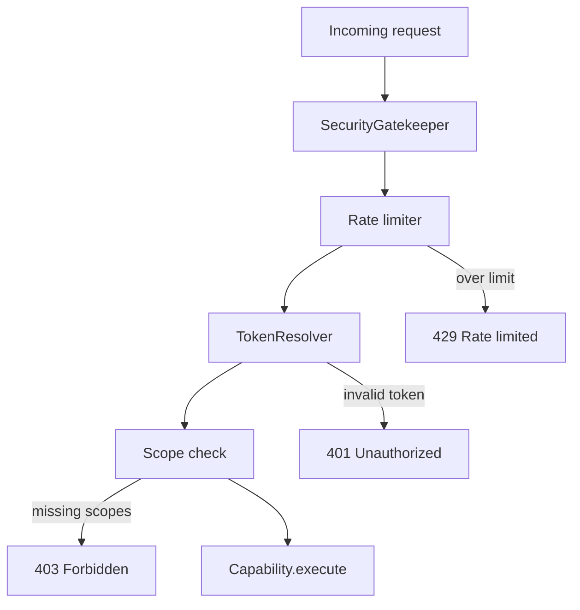

# Security

Security model, threat considerations, and production hardening checklist for Lite-Toon deployments.

> The demo app is a **reference implementation**, not a production auth system. The SDK provides building blocks; you are responsible for hardening them before exposing real user data.

## Security architecture



## SecurityGatekeeper

Location: `packages/core/src/security.ts`

### Checks performed (in order)

1. **Rate limiting** — increment counter for `agentId` (or IP)
2. **API key validation** — legacy `secret-dummy-token` check (placeholder only)
3. **Bearer token resolution** — if `requireAuth` or token present
4. **Scope enforcement** — if `requiredScopes` specified

### Configuration

```typescript
const gatekeeper = new SecurityGatekeeper({
  store: customRateLimiterStore,  // default: InMemoryRateLimiterStore
  maxRequests: 100,               // per window
  windowMs: 60000,                // 1 minute
  tokenResolver: oauthServer,
});
```

### Error messages

Errors use `TOON_` prefixes for machine parsing:

| Prefix | HTTP status (JSON endpoints) |
|---|---|
| `TOON_RATE_LIMIT_EXCEEDED` | 429 |
| `TOON_UNAUTHORIZED` | 401 |
| `TOON_FORBIDDEN` | 403 |

## Authentication layers

### Layer 1: Session cookie (browser login)

| Property | Demo value | Production |
|---|---|---|
| Cookie name | `lite_toon_session` | Same or custom |
| `httpOnly` | Yes | Yes |
| `sameSite` | `lax` | `lax` or `strict` |
| `secure` | **No** | **Yes** (HTTPS only) |
| `maxAge` | 86400s | Configure per policy |

Used only for the OAuth authorize redirect flow (user logs in at `/login`).

### Layer 2: OAuth access tokens (agent API calls)

| Property | Demo value | Production |
|---|---|---|
| Generation | `Math.random()` | `crypto.randomBytes(32)` or signed JWT |
| Storage | In-memory Map | Redis / database |
| TTL | 3600s | Configure per policy |
| Revocation | Not supported | Implement token revocation |

### Layer 3: Per-user execution context

Every authenticated capability call receives `userId` from token resolution. Business logic must use this for data isolation — never trust client-supplied user IDs in request bodies.

## Endpoint auth matrix

| Path | Demo auth | Production recommendation |
|---|---|---|
| `POST /api/tools/*` | Bearer + scopes | Same (already enforced) |
| `POST /api/mcp` (tools/call) | Bearer + scopes | Same |
| `GET /api/mcp` | None (SSE stream) | Same as POST for production |
| `GET /api/openapi.json` | None | Public is fine (schema only) |
| `GET /api/oauth/authorize` | Session cookie | Same + CSRF state validation |
| `POST /api/oauth/token` | PKCE verification | Same + rate limit |
| `POST /api/oauth/login` | None | Replace with real auth |
| `POST /api/agent` | Optional | **Require auth** for sensitive capabilities |
| `GET/POST/DELETE /api/cart` | Session cookie | Same + CSRF protection |
| `GET /api/products`, `GET /api/me` | Session cookie (cart/me) | Same |

## Scope enforcement

Capabilities declare required scopes:

```typescript
scopes: ['cart:write']
```

Enforced at:

1. **Gatekeeper** — rejects request before execution if scopes missing
2. **Registry** — double-checks in `execute()` if user is authenticated

### Principle of least privilege

- Grant agents only the scopes they need
- ChatGPT Custom GPT scope: `cart:read cart:write` (demo) — narrow in production
- Consider read-only agents that only get `cart:read`

## Rate limiting

### Demo behavior

- In-memory per process (not shared across instances)
- Key: `x-agent-id` → `x-forwarded-for` → `"anonymous"`
- Default: 100 requests per 60 seconds

### Production recommendations

- Use a shared store (`RateLimiterStore` interface) backed by Redis
- Rate limit OAuth token endpoint separately (prevent brute force)
- Rate limit by `userId` in addition to `agentId`
- Return `Retry-After` header on 429

```typescript
class RedisRateLimiterStore implements RateLimiterStore {
  async increment(key: string): Promise<number> { /* ... */ }
  async reset(key: string): Promise<void> { /* ... */ }
}
```

## Demo-only behaviors (do not deploy as-is)

| Area | Demo behavior | Risk | Production fix |
|---|---|---|---|
| Login | Username only, no password | Account impersonation | OAuth with IdP, MFA, credentials |
| Tokens | `Math.random()` | Predictable tokens | `crypto.randomBytes()` or JWT with RS256 |
| Auth store | In-memory | Data loss, no clustering | Redis, PostgreSQL, managed IdP |
| Session cookie | No `secure` flag | Hijack over HTTP | `secure: true` behind HTTPS |
| `/api/agent` | Anonymous access | Unauthorized reads | `requireAuth: true` on gatekeeper |
| `/api/cart` | Session cookie only | CSRF on mutations | CSRF tokens + `sameSite: strict` |
| Redirect URIs | Hardcoded list | Open redirect if misconfigured | Strict allowlist per environment |
| CORS | Next.js defaults | Cross-origin abuse | Explicit CORS policy |
| Logging | Console warnings | Token exposure in logs | Redact tokens in all logs |

## Production checklist

### Before first deploy

- [ ] Replace `InMemoryAuthStore` with persistent `AuthStore`
- [ ] Use cryptographically secure token generation
- [ ] Enable `secure: true` on session cookies
- [ ] Deploy behind HTTPS (TLS termination)
- [ ] Set `requireAuth: true` on `/api/agent` or disable the endpoint
- [ ] Validate `allowedRedirectUris` for your exact domain(s)
- [ ] Copy `.env.example` — never commit `.env.local`
- [ ] Rotate any tokens pasted into logs or chat tools

### Ongoing

- [ ] Monitor rate limit hits and 401/403 rates
- [ ] Implement token revocation
- [ ] Audit capability scopes periodically
- [ ] Review OpenAPI spec for information leakage
- [ ] Keep dependencies updated (`npm audit`)

## What is safe to publish

| Item | Notes |
|---|---|
| Source code in this repo | No API keys or secrets committed |
| Demo client ID `lite-toon-demo` | Public identifier — not a secret |
| `secret-dummy-token` in gatekeeper | Placeholder for legacy API-key samples |
| OpenAPI spec | Describes public API surface |

## Reporting vulnerabilities

Report security issues privately to the repository maintainer — not in public GitHub issues.

## Related

- [OAuth](../concepts/oauth.md)
- [Capabilities — scopes](../concepts/capabilities.md#oauth-scopes)
- [API Reference — error codes](../reference/api.md#error-format)
- [README — Security section](../README.md)
